# Getting Started with OpenHelpDesk

This is the long-form, end-to-end guide for setting up OpenHelpDesk on a fresh server and configuring it for production use. It walks through everything in order: prerequisites, server install, the web installer wizard, cron jobs, branding, email, your organisational structure (locations, groups, types, priorities, users), SLA policies, ticket routing, inbound email (IMAP + Microsoft Graph), automations, escalations, the optional AI triage layer, CSAT surveys, custom fields, the knowledge base, scheduled reports, two-factor auth, SSO, the REST API, backups, importing data, and routine maintenance.

If you only want to spin up an evaluation copy on your laptop, jump to [Installation](#3-installation). If you've already installed and just need to know which knobs do what, scan the [Table of Contents](#table-of-contents) and dive into the section you care about.

> Most pages in the admin UI also link to deeper in-app documentation at **Admin → Docs**. This guide is the cradle-to-grave overview; the in-app docs are the per-feature reference.

---

## Table of Contents

1. [What you're installing](#1-what-youre-installing)
2. [Before you start](#2-before-you-start)
3. [Installation](#3-installation)
   - 3.1 [Choosing an install path](#31-choosing-an-install-path)
   - 3.2 [Web server configuration](#32-web-server-configuration)
   - 3.3 [Permissions](#33-permissions)
4. [The web installer wizard](#4-the-web-installer-wizard)
5. [First login & onboarding tour](#5-first-login--onboarding-tour)
6. [Cron jobs — critical post-install step](#6-cron-jobs--critical-post-install-step)
7. [Initial configuration walkthrough](#7-initial-configuration-walkthrough)
   - 7.0 [Organization type](#70-organization-type)
   - 7.1 [Email / SMTP](#71-email--smtp)
   - 7.2 [Application name & label customisation](#72-application-name--label-customisation)
   - 7.3 [Branding](#73-branding)
   - 7.4 [Business hours & timezone](#74-business-hours--timezone)
   - 7.5 [Holidays & closed days](#75-holidays--closed-days)
8. [Organisational structure](#8-organisational-structure)
   - 8.1 [Locations](#81-locations)
   - 8.2 [Ticket types](#82-ticket-types)
   - 8.3 [Priorities](#83-priorities)
   - 8.4 [Tags](#84-tags)
   - 8.5 [Groups](#85-groups)
   - 8.6 [Agent skills](#86-agent-skills)
   - 8.7 [Users](#87-users)
   - 8.8 [Self-registration & email verification](#88-self-registration--email-verification)
9. [SLA policies](#9-sla-policies)
10. [Ticket routing & auto-assignment](#10-ticket-routing--auto-assignment)
11. [Inbound email](#11-inbound-email)
    - 11.1 [Email-to-Ticket](#111-email-to-ticket)
    - 11.2 [Reply processing — Microsoft Graph API](#112-reply-processing--microsoft-graph-api)
    - 11.3 [Reply processing — IMAP fallback](#113-reply-processing--imap-fallback)
    - 11.4 [Hashtag commands](#114-hashtag-commands)
12. [Automations](#12-automations)
13. [Escalations](#13-escalations)
    - 13.1 [Time-based escalation rules](#131-time-based-escalation-rules)
    - 13.2 [Manual escalation paths](#132-manual-escalation-paths)
    - 13.3 [Stale ticket notifications](#133-stale-ticket-notifications)
14. [AI ticket triage (optional)](#14-ai-ticket-triage-optional)
15. [CSAT surveys](#15-csat-surveys)
16. [Marking a comment as the solution](#16-marking-a-comment-as-the-solution)
17. [Custom ticket fields (form builder)](#17-custom-ticket-fields-form-builder)
18. [Ticket templates](#18-ticket-templates)
19. [Knowledge base](#19-knowledge-base)
20. [Email templates](#20-email-templates)
21. [Scheduled reports](#21-scheduled-reports)
22. [Notifications & user preferences](#22-notifications--user-preferences)
23. [Authentication — 2FA & Microsoft 365 SSO](#23-authentication--2fa--microsoft-365-sso)
24. [Portal & floor mode](#24-portal--floor-mode)
25. [REST API & mobile tokens](#25-rest-api--mobile-tokens)
26. [Backups](#26-backups)
27. [Importing existing data](#27-importing-existing-data)
28. [Maintenance & troubleshooting](#28-maintenance--troubleshooting)
29. [Danger zone — full reset](#29-danger-zone--full-reset)
30. [Appendix A — Cron job reference](#appendix-a--cron-job-reference)
31. [Appendix B — Key URL endpoints](#appendix-b--key-url-endpoints)
32. [Appendix C — Environment variables](#appendix-c--environment-variables)
33. [Appendix D — Further reading](#appendix-d--further-reading)

---

## 1. What you're installing

**OpenHelpDesk** is a self-hosted IT helpdesk and ticketing system on a plain LAMP stack: PHP 8 with a lightweight custom router, PDO + MySQL, and Bootstrap 5. There are no Node build steps, no daemons to keep alive, no message broker — just a web app and a handful of cron scripts.

In one helpdesk you get the full ticket lifecycle (open → in progress → pending → waiting on customer / third-party → resolved → closed), per-priority SLAs with business-hours and per-location timezone awareness, internal notes, attachments, tags, merging and splitting, bulk actions, custom form fields, a drag-and-drop form builder, a three-tier knowledge base with a public help centre, twelve built-in reports plus a custom report builder, CSAT surveys, rule-based automations, time-based escalations, inbound email (IMAP **or** Microsoft Graph), email-to-ticket, hashtag commands, Microsoft 365 SSO, optional TOTP 2FA, four roles (Admin / Power User / Agent / User), an end-user portal, an iPad-friendly "floor mode" for roaming staff, configurable branding, one-click backups, and a Bearer-token REST API with an OpenAPI spec.

It also has an **optional AI triage layer** powered by Anthropic Claude or OpenAI. Pasted-in API key — no extra services to run. The AI reads each incoming ticket, suggests the agent skills it needs, scores its own confidence, and tags sentiment. It can auto-route the ticket to the best-matching agent, hand "I'm not sure who handles this" tickets off to the right group ("No Wrong Door"), and bump priority when a requester sounds angry or urgent. Confidential ticket types are never sent to a provider; every call has a hard timeout with graceful fallback to manual routing.

Released under the [MIT License](LICENSE).

> Architecture in one paragraph: requests hit `public/index.php`, which boots `src/bootstrap.php` (env + session + migrations), then dispatches through `src/Router.php` to a route file in `src/routes/`. Each route renders a PHP template from `templates/pages/...`. Long-running jobs (SLA recalc, inbound mail, escalations, stale-ticket emails, scheduled reports) live in `scripts/` and are invoked by cron. The database schema sits in `database/schema.sql`; numbered migration files in `database/migrations/` apply incrementally on every request, so deploying is `git pull` (plus a permission fix if you run as `www-data`).


*Admin dashboard — your home base after logging in.*

---

## 2. Before you start

You need:

| Requirement | Minimum | Notes |
|---|---|---|
| **PHP** | 8.0 | Tested up to 8.3. The installer's Requirements step verifies the version. |
| **MySQL / MariaDB** | MySQL 5.7 / MariaDB 10.3 | Uses InnoDB and `utf8mb4`. MySQL 8 works fine. |
| **PHP extensions** | `pdo_mysql`, `mbstring`, `json`, `openssl`, `fileinfo`, `zip` | All are in the stock PHP package on Debian / Ubuntu / RHEL / XAMPP. |
| **Composer** | 2.x | Used to install Bootstrap, PHPMailer, CommonMark, the OAuth library, etc. |
| **A web server** | Apache 2.4 or IIS 10 | Nginx works too with an `index.php` front-controller rewrite, but the bundled rewrite rules are Apache `.htaccess` and IIS `web.config`. |
| **Outbound SMTP** | Any provider | Gmail, Microsoft 365, SendGrid, Mailgun, Postfix on the same host — anything that speaks SMTP. Optional during install. |
| **Disk space** | ~250 MB initial | Database tables are small; the bulk is `vendor/` (~80 MB) and uploaded attachments under `storage/attachments/`. |

You also want:

- **A real hostname.** Use `https://helpdesk.example.com` rather than `http://localhost` for anything beyond an evaluation install — magic ticket-reply links, Microsoft SSO callbacks, and CSAT survey links all bake the `APP_URL` into outgoing emails.
- **Shell access to the server.** You'll add cron jobs (Section 6) and may need to fix file ownership after `git pull`.
- **A dedicated mailbox if you want inbound email.** A shared mailbox like `helpdesk@yourdomain.com` works. For Microsoft Graph you'll also want a Global Admin who can grant API permissions in Azure.

If any of those are missing — install anyway. SMTP, inbound email, SSO and AI are all optional, and you can wire them up later without losing data.

---

## 3. Installation

### 3.1 Choosing an install path

There are three ways to install OpenHelpDesk; all end up at the same place.

**Option A — Web installer (recommended).** A six-step wizard that lives at `/install/` until you complete it. Verifies your PHP setup, creates the database (or uses an existing one), captures admin credentials and SMTP settings, applies the schema, and writes `.env` for you. After it runs successfully it writes `storage/installed.lock` and the installer refuses to run again.

**Option B — Quick evaluation with PHP's built-in server (no Apache/IIS required).** Good for kicking the tyres on a laptop. Clone the repo, `composer install`, then start the dev server and open the installer:

```bash
php -S 127.0.0.1:8000 -t public public/index.php
# now open http://127.0.0.1:8000/install/ in a browser
```

You still need MySQL or MariaDB running (default `127.0.0.1:3306`). PHP's built-in server is single-threaded and not production-ready — switch to Apache or IIS for anything beyond evaluation.

**Option C — Manual.** Useful when you're scripting a deploy, when the web installer's session isn't reachable behind a corporate proxy, or when you simply prefer the shell. Clone the repo, copy `.env.example` to `.env`, fill it in, and run `php database/seed.php`. This drops and recreates the database with bundled demo content; for a *bare* install run `database/seed.php --no-data` (or apply `database/schema.sql` against an empty database yourself).

Options A and C assume you have already pointed your web server's document root at the project's **`public/`** directory and enabled URL rewriting. That part is covered next.

### 3.2 Web server configuration

The **`DocumentRoot`** must point to the project's `public/` subdirectory, not the project root — every other directory contains code or storage that should never be served directly. URL rewriting must be enabled so that all requests are routed through `public/index.php`.

#### XAMPP on Windows

A handy local-eval setup.

1. Clone the repository somewhere XAMPP can read it, e.g. `C:\xampp\htdocs\openhelpdesk`, then run `composer install` in that directory. If composer aborts with `Could not delete vendor/composer/tmp-<hash>.zip … antivirus or Windows Search Indexer`, simply re-run `composer install` — the second attempt almost always succeeds once the AV scanner has released the file.

2. Open `C:\xampp\apache\conf\extra\httpd-vhosts.conf` and add:

   ```apache
   <VirtualHost *:80>
       ServerName openhelpdesk.test
       DocumentRoot "C:/xampp/htdocs/openhelpdesk/public"

       <Directory "C:/xampp/htdocs/openhelpdesk/public">
           AllowOverride All
           Require all granted
       </Directory>
   </VirtualHost>
   ```

   While you're there, confirm `C:\xampp\apache\conf\httpd.conf` has the line `Include conf/extra/httpd-vhosts.conf` uncommented — on some XAMPP builds it's commented out by default and your vhost is silently ignored.

3. Add `127.0.0.1 openhelpdesk.test` to `C:\Windows\System32\drivers\etc\hosts`. **You must run your text editor as Administrator** to save changes to this file — Notepad will silently fail and offer to "Save As" elsewhere if you don't.

4. In `C:\xampp\apache\conf\httpd.conf`, ensure `LoadModule rewrite_module modules/mod_rewrite.so` is **not** commented out. The bundled rewrite rules at `public/.htaccess` will then take effect automatically — there's nothing to write yourself.

5. Restart Apache from the XAMPP Control Panel.

6. Visit `http://openhelpdesk.test/install/`.

#### LAMP on Ubuntu / Debian

The production path.

```bash
# 1. System packages
sudo apt update
sudo apt install -y apache2 php php-mysql php-mbstring php-xml php-zip php-curl \
                    php-fileinfo composer mariadb-server unzip git

# 2. Code
sudo mkdir -p /var/www/openhelpdesk
sudo chown -R $USER:www-data /var/www/openhelpdesk
git clone https://github.com/REPLACE-WITH-YOUR-FORK/openhelpdesk.git /var/www/openhelpdesk
cd /var/www/openhelpdesk
composer install --no-dev --optimize-autoloader

# 3. Apache mod_rewrite
sudo a2enmod rewrite
sudo systemctl restart apache2
```

The bundled `public/.htaccess` already contains the front-controller rewrite rules — once `mod_rewrite` is enabled and `AllowOverride All` is set in the vhost, no further rewrite config is needed.

Create `/etc/apache2/sites-available/openhelpdesk.conf`:

```apache
<VirtualHost *:80>
    ServerName helpdesk.example.com
    DocumentRoot /var/www/openhelpdesk/public

    <Directory /var/www/openhelpdesk/public>
        AllowOverride All
        Require all granted
    </Directory>

    ErrorLog  ${APACHE_LOG_DIR}/openhelpdesk-error.log
    CustomLog ${APACHE_LOG_DIR}/openhelpdesk-access.log combined
</VirtualHost>
```

Enable the site and reload:

```bash
sudo a2ensite openhelpdesk.conf
sudo systemctl reload apache2
```

**Front it with HTTPS.** Once you're past the installer:

```bash
sudo apt install -y python3-certbot-apache
sudo certbot --apache -d helpdesk.example.com
```

Certbot will update the vhost to listen on 443 and add an HTTP→HTTPS redirect. After that, set `APP_URL=https://helpdesk.example.com` in `.env` so email links don't open the plain-HTTP version.

#### IIS on Windows

IIS doesn't read `.htaccess`, so the bundled `public/web.config` carries the equivalent rewrite rules.

1. Install **PHP** (e.g. via Web Platform Installer or manually) and register it as a FastCGI handler.
2. Install the **URL Rewrite** module from the IIS website.
3. In **IIS Manager**, create a new site. Set **Physical path** to the `public\` subdirectory of the project.
4. If `public\web.config` is missing, create it with:

   ```xml
   <?xml version="1.0" encoding="UTF-8"?>
   <configuration>
     <system.webServer>
       <rewrite>
         <rules>
           <rule name="OpenHelpDesk Front Controller" stopProcessing="true">
             <match url="^(.*)$" />
             <conditions>
               <add input="{REQUEST_FILENAME}" matchType="IsFile" negate="true" />
               <add input="{REQUEST_FILENAME}" matchType="IsDirectory" negate="true" />
             </conditions>
             <action type="Rewrite" url="index.php" />
           </rule>
         </rules>
       </rewrite>
     </system.webServer>
   </configuration>
   ```

5. Give the application pool identity **read/write** access to `storage\`.

### 3.3 Permissions

OpenHelpDesk writes to four places at runtime. They all live under `storage/`:

| Directory | Used for |
|---|---|
| `storage/attachments/` | Ticket file attachments (outside webroot — never served directly). |
| `storage/backups/` | One-click backup `.zip` files (outside webroot). |
| `storage/imports/` | Temporary CSV staging for ticket / user / KB imports. |
| `storage/logs/` | `smtp.log`, `graph-mail.log`, `escalations.log`, `sla-cron.log`, etc. |

The web server's user (`www-data` on Debian / Ubuntu, `apache` on RHEL, the IIS application pool on Windows) must be able to write to all four. After every `git pull` on Linux:

```bash
sudo chown -R www-data:www-data /var/www/openhelpdesk
```

The installer creates `attachments/`, `logs/`, `imports/`, `backups/` and `pwa/` for you on a fresh install, but if you cloned manually you may need to `mkdir -p` them and chmod them readable+writable by the web user.

The project also writes `.env` once during install. The directory containing the project root must be writable by the web user **only during the install step** — afterwards `.env` is read-only as far as the app is concerned, and you can lock the directory down.

---

## 4. The web installer wizard

Visit `http://your-server/install/` in a browser. You'll be walked through six steps; on every step the system stores your answers in the PHP session so you can navigate back if you spot a typo.

### Step 1 — Requirements

A green check-list of nine items:

- PHP ≥ 8.0
- `pdo`, `pdo_mysql`, `mbstring`, `json`, `openssl`, `fileinfo`, and `zip` extensions
- Composer autoloader (`vendor/autoload.php`) present
- Project root writable (so `.env` can be created)
- `storage/` writable

Every box must be green before **Continue** unlocks. If something is red, the inline help text tells you what to install or chmod.

### Step 2 — Database

Enter the MySQL host, port, name, username and password. Optionally check **Create database if it doesn't exist** — the installer will `CREATE DATABASE IF NOT EXISTS …` using a `utf8mb4_unicode_ci` collation. The installer tests the connection live; if credentials are wrong you see the underlying MySQL error verbatim, not a generic "connection failed."

Default values: `127.0.0.1`, port `3306`, database name `localdesk` (yes — the database is still called `localdesk` even though the project was renamed; renaming it is unnecessary and would only complicate upgrades).

### Step 3 — Application

Three fields:

- **Application name** — the display name shown in the navbar, page titles, login page, and emails. You can change it later in **Settings → Branding**.
- **Application URL** — the full base URL of your install (e.g. `https://helpdesk.example.com`). This goes into every email link. **Set this correctly.** Email-to-ticket replies will silently fail to associate if the URL drifts later.
- **Timezone** — pick from a curated list (UTC plus the major America/Europe/Asia/Australia/Africa zones). This sets `APP_TIMEZONE` in `.env` and is the default timezone used wherever a location-specific timezone isn't set.

There's also an **Enable debug mode** checkbox. Leave it **on for a single-host evaluation** — you'll see PHP errors directly. **Turn it off in production** so stack traces don't leak to users.

### Step 4 — Admin account

Create the first administrator: first name, last name, email, password (≥ 8 characters), password confirmation. This account becomes the Admin role and can do everything. You can add more admins, agents and users later from inside the UI.

> Password hashing uses bcrypt at the default PHP cost. The plaintext is never stored or written to disk.

### Step 5 — Mail server (optional)

SMTP host, port, encryption (TLS / SSL / none), username, password, From address, From name. If you leave the SMTP host blank and click **Skip**, the installer will not configure outbound mail — you can do it later in **Admin → Settings → Email / SMTP**.

Sensible defaults:

- **Gmail** — `smtp.gmail.com`, port `587`, TLS. Use an [app password](https://myaccount.google.com/apppasswords) when 2FA is on (which it should be).
- **Microsoft 365** — `smtp.office365.com`, port `587`, TLS. The sending account needs SMTP AUTH explicitly enabled by your tenant admin.
- **SendGrid / Mailgun / Postmark** — see your provider's SMTP docs. Username is usually `apikey` and password is the API key.

### Step 6 — Review & install

The installer recaps every value you entered (passwords masked) and waits for you to click **Run Installation**. When you do, it:

1. Writes `.env` with the values you gave it.
2. Connects to the database and applies `database/schema.sql` (49 tables).
3. Records every existing migration as already-applied in `schema_migrations` so future migrations layer on cleanly without re-running history.
4. Seeds the four default priorities — Low, Medium, High, Critical — each with a colour.
5. Creates your admin user.
6. Stores the SMTP settings (if any) and your chosen app name as the initial branding.
7. Flags the onboarding tour to run on first login.
8. Creates `storage/attachments/`, `storage/logs/`, `storage/imports/`, `storage/backups/`, `storage/pwa/`.
9. Writes `storage/installed.lock` so the wizard refuses to run again.

A green success page appears with a **Go to Login** button. You're done with the installer.

### Locking it down

The installer is self-protecting (`installed.lock` makes it refuse to re-run), but it's still good hygiene to remove it from the webroot once the install succeeds:

```bash
# Recommended once you've verified you can log in:
sudo rm -rf /var/www/openhelpdesk/public/install
```

Removing the directory entirely makes the lockfile redundant and reduces attack surface to zero.


*The login page after install. Your admin credentials from Step 4 work here.*

---

## 5. First login & onboarding tour

Log in with the admin email and password you created. You'll land at `/admin` — the admin dashboard.

The **first-login onboarding tour** (Driver.js) automatically launches with a six-step walkthrough pointing at the dashboard cards, the sidebar, the ticket queue, the user dropdown, the notification bell, and the help docs. You can replay it any time from the avatar menu (top-right) → **Replay onboarding tour**.

Take a moment to note three things in the navbar:

- **Notification bell** — polls every 15 seconds for @mentions and system notifications.
- **Global search** (top centre) — type any text to search tickets by subject, body, requester or tags; type a number to jump straight to that ticket.
- **Avatar menu** (top right) — your profile, theme toggle, 2FA setup, replay tour, logout.

And in the left sidebar:

- **Dashboard** — KPIs and recent activity.
- **Tickets** — the queue, with the slide-out filter panel.
- **Users / Groups / KB / Reports / Audit log / Docs / Settings** — admin tools.

You can do everything in this guide without leaving these two surfaces.

---

## 6. Cron jobs — critical post-install step

OpenHelpDesk relies on a handful of background scripts to keep SLA states current, fire escalation rules, poll for inbound email, send scheduled reports, and remind you about expiring secrets. **Without cron, your helpdesk works for ticket creation but SLAs will not breach on time, escalation rules will never fire, and inbound email will pile up unprocessed.** Set this up now.

Go to **Admin → Settings → Cron Jobs**. The page shows the full crontab with absolute paths for your install, plus a status panel that tells you, for each job, whether its log file has been touched in the last (2 × expected interval) — i.e. whether cron is actually running it.

### Recommended crontab

On Linux, `crontab -e` (as the user that owns the project files — usually `www-data` if you followed the LAMP setup above):

```cron
# SLA recalculation — every 5 minutes (required)
*/5  * * * * php /var/www/openhelpdesk/public/sla-cron.php                >> /var/www/openhelpdesk/storage/logs/sla-cron.log         2>&1

# Inbound email replies — every 5 minutes (only if Microsoft Graph / IMAP is configured)
*/5  * * * * php /var/www/openhelpdesk/scripts/process-replies.php        >> /var/www/openhelpdesk/storage/logs/graph-mail.log       2>&1

# Time-based escalation rules — every 15 minutes (only if you have escalation rules)
*/15 * * * * php /var/www/openhelpdesk/scripts/process-escalations.php    >> /var/www/openhelpdesk/storage/logs/escalations.log      2>&1

# Recurring / preventive-maintenance tickets — every 15 minutes (only if recurring schedules are configured)
*/15 * * * * php /var/www/openhelpdesk/scripts/process-recurring-tickets.php >> /var/www/openhelpdesk/storage/logs/recurring-tickets.log 2>&1

# Scheduled reports — every 30 minutes (only if scheduled reports exist)
*/30 * * * * php /var/www/openhelpdesk/scripts/process-scheduled-reports.php >> /var/www/openhelpdesk/storage/logs/scheduled-reports.log 2>&1

# Stale ticket notifications — hourly (configurable in Settings → Stale Tickets)
0    * * * * php /var/www/openhelpdesk/scripts/process-stale-tickets.php  >> /var/www/openhelpdesk/storage/logs/stale-tickets.log    2>&1

# Microsoft Graph app-secret expiry reminders — daily at 08:00 (only if Graph is configured)
0    8 * * * php /var/www/openhelpdesk/scripts/process-secret-reminders.php >> /var/www/openhelpdesk/storage/logs/secret-reminders.log 2>&1
```

The Cron Jobs page also offers a single combined block you can copy-paste in one shot.

### Verifying it ran

After a few minutes return to **Settings → Cron Jobs**. Each card shows one of three badges:

- **Running · 23s ago** — green. The log file was written within 2× the expected interval.
- **Stale · 12h ago** — amber. The log file exists but cron hasn't touched it in a long time — usually means cron stopped or the crontab line has a typo.
- **Not configured** — grey. No log file at all; the job has never run.

If you see **Stale** or **Not configured** on the SLA job, fix that first — it's the only job marked **Required** and the only one that breaks user-visible behaviour silently.

### Windows — Task Scheduler

On Windows there is no `cron`; the equivalent is **Task Scheduler**. The Cron Jobs page detects Windows server-side and emits ready-to-paste `schtasks /Create` commands, but you can also build the tasks by hand in the Task Scheduler GUI. Both paths are covered below.

> **Important — logging gotcha.** The `schtasks` command emitted by the admin page runs `php.exe script.php` directly and does **not** redirect output to a log file the way the Linux `>> log 2>&1` form does. The scripts still run correctly, but **the Cron Jobs status dashboard reads log-file mtimes to decide if a job is "Running"** — so without redirection every card will sit at "Not configured" forever. The fix is the wrapper `.bat` files in **Option B** below.

#### Option A — `schtasks` command line (fast)

Open an **elevated** PowerShell or Command Prompt (Run as Administrator — non-admin shells get "Access is denied.") and paste each command from **Admin → Settings → Cron Jobs**. Example for the SLA recalculation on a default XAMPP install:

```powershell
schtasks /Create /TN "OpenHelpDesk SLA Recalculation" /TR "'C:\xampp\php\php.exe' 'C:\xampp\htdocs\openhelpdesk\public\sla-cron.php'" /SC MINUTE /MO 5 /F
```

The `/F` flag overwrites an existing task with the same name, so re-pasting an updated command is safe. Repeat for each job listed on the Cron Jobs page (SLA, Inbound Email, Escalations, Recurring Tickets, Scheduled Reports, Stale Ticket Notifications, Secret Reminders).

#### Option B — wrapper `.bat` files (recommended; makes the status dashboard work)

Create one `.bat` file per job in `C:\xampp\htdocs\openhelpdesk\scripts\windows\` (create the folder if it doesn't exist — any folder is fine, this just keeps them together):

```bat
@echo off
"C:\xampp\php\php.exe" "C:\xampp\htdocs\openhelpdesk\public\sla-cron.php" >> "C:\xampp\htdocs\openhelpdesk\storage\logs\sla-cron.log" 2>&1
```

Then point Task Scheduler at the `.bat` instead of `php.exe`:

```powershell
schtasks /Create /TN "OpenHelpDesk SLA Recalculation" /TR "C:\xampp\htdocs\openhelpdesk\scripts\windows\sla-cron.bat" /SC MINUTE /MO 5 /F
```

Now each run appends to the log, the dashboard shows **Running · Ns ago**, and you have a real audit trail you can `Get-Content -Tail 50 storage\logs\sla-cron.log` if something misbehaves. Repeat with one `.bat` + one `schtasks` line per job, mirroring the script paths and intervals shown on the Cron Jobs page.

#### Option C — Task Scheduler GUI walkthrough

If you'd rather click through it, this is the canonical way to register the SLA recalculation job. Use **Create Task** (not **Create Basic Task** — Basic Task can't repeat sub-daily without workarounds and exposes fewer reliability knobs).

1. **Win + R → `taskschd.msc` → Enter.** In the right-hand Actions pane click **Create Task…**.
2. **General tab:**
   - **Name:** `OpenHelpDesk SLA Recalculation`
   - **Description (optional):** `Recalculates SLA states every 5 minutes.`
   - Select **Run whether user is logged on or not** (so the task fires when no one is signed in).
   - Tick **Run with highest privileges**.
   - **Configure for:** `Windows 10` (also fine for Windows 11 / Server 2019+).
3. **Triggers tab → New…**
   - **Begin the task:** `On a schedule`
   - **Settings:** `Daily`, recur every `1` day, with a start date/time of today.
   - Under **Advanced settings**, tick **Repeat task every:** `5 minutes` (type the value in — the dropdown only shows 5 / 10 / 15 / 30 minutes / 1 hour) **for a duration of:** `Indefinitely`.
   - Leave **Enabled** ticked. **OK**.
4. **Actions tab → New…**
   - **Action:** `Start a program`
   - **Program/script:** `C:\xampp\htdocs\openhelpdesk\scripts\windows\sla-cron.bat` (the wrapper from Option B). If you skipped the wrapper, use `C:\xampp\php\php.exe` and put `C:\xampp\htdocs\openhelpdesk\public\sla-cron.php` in **Add arguments**.
   - **Start in:** `C:\xampp\htdocs\openhelpdesk` (important — without this, relative `.env` and `vendor/autoload.php` lookups fail).
5. **Conditions tab:**
   - Untick **Start the task only if the computer is on AC power** (otherwise jobs silently pause on a laptop).
6. **Settings tab:**
   - Tick **Allow task to be run on demand** (lets you right-click → **Run** for an instant test).
   - **If the task is already running, then the following rule applies:** `Do not start a new instance` (prevents pile-ups if a run ever overruns its 5-minute window).
   - **Stop the task if it runs longer than:** `1 hour` (safety net).
7. **OK** → Windows prompts for the password of the account the task runs under. Use a service account or a local admin whose password doesn't expire — if the password ever changes the task silently stops firing until you re-enter it.

Repeat steps 1–7 for each remaining job, swapping in the script path, task name, and repetition interval from **Admin → Settings → Cron Jobs**. Use the table in [Appendix A](#appendix-a--cron-job-reference) as the master list.

#### Verifying on Windows

- **`schtasks /Query /FO LIST /V /TN "OpenHelpDesk SLA Recalculation"`** shows last-run time, next-run time, and last result (`0x0` = success). Drop `/TN` to list every scheduled task on the box.
- In **Task Scheduler**, select the task and open the **History** tab — every fire is logged with timestamps and exit codes. If History is empty, click **Enable All Tasks History** in the right-hand Actions pane (it's off by default on some Windows builds).
- Back in OpenHelpDesk, **Admin → Settings → Cron Jobs** should flip to green within 2× the schedule interval — but **only if you used Option B** (wrapper `.bat`). With Option A the cards stay grey even though the jobs are firing fine, because no log file is being written for the dashboard to read.
- To force an immediate run for testing: `schtasks /Run /TN "OpenHelpDesk SLA Recalculation"`, or right-click → **Run** in the GUI.

### HTTP-only fallback for the SLA recaler

If you cannot run a real cron at all, the SLA script can be triggered over HTTP from any external monitor (UptimeRobot, etc.). Set `SLA_CRON_TOKEN` in your `.env` to a random string, then hit:

```
GET https://helpdesk.example.com/sla-cron.php?token=YOUR_SLA_CRON_TOKEN
```

This is **only** appropriate for the SLA job; the others write to local logs and aren't designed to be HTTP-triggered.

---

## 7. Initial configuration walkthrough

You can configure everything in any order, but the path of least friction is roughly:

1. Organization type (so vocabulary and example data match your sector).
2. SMTP (so test emails and welcome emails work).
3. Application name + label vocabulary (because changing them later means re-explaining things to your team).
4. Branding (instant gratification).
5. Business hours + holidays (because SLA depends on them).
6. Your organisational structure — locations → types → priorities → tags → groups → users.
7. SLA policies (which use priorities and types).
8. Ticket routing defaults (which use groups).
9. The optional stuff: inbound email, automations, escalations, AI, CSAT, custom fields, KB, etc.

The rest of this guide follows that order.

### 7.0 Organization type

**Admin → Settings → Organization Type.** A single drop-down that tells the app what sector you're in — `K-12 School`, `Public Library`, `Higher Education`, `Government — Municipal`, `Hospital`, `Corporation`, `Non-Profit`, and ~20 others. The selection influences sample data, default ticket-type names, label vocabulary defaults, and which built-in KB starter articles get suggested. None of it is binding — every field can still be renamed later via **Settings → Labels** — but picking the right one up front saves a round of renaming.

If your scenario doesn't have a perfect match, pick the closest fit. A K-12 school district covering multiple buildings, for example, would pick `K-12 School` and rely on **Locations** (Section 8.1) to model the individual schools.

### 7.1 Email / SMTP

**Admin → Settings** → top card, **Email / SMTP Configuration**.

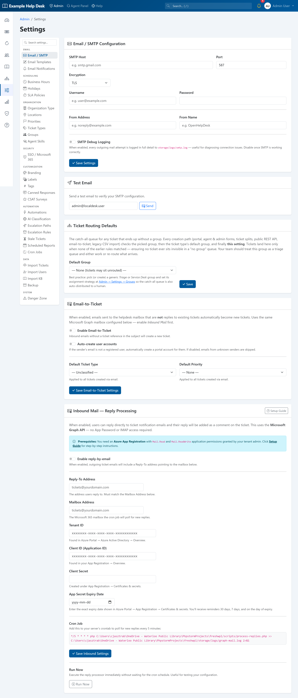
*The main Settings page — Email / SMTP, Test Email, Ticket Routing Defaults, Email-to-Ticket, and Inbound Mail (Microsoft Graph) all on one screen. The sidebar on the left jumps to every other settings area.*

Five fields plus From info:

| Field | Notes |
|---|---|
| **SMTP Host** | e.g. `smtp.gmail.com`, `smtp.office365.com`, `email-smtp.us-east-1.amazonaws.com`. |
| **Port** | `587` for STARTTLS (the common case), `465` for legacy implicit SSL, `25` for unauthenticated/relay. |
| **Encryption** | TLS / SSL / None. Use TLS unless you have a specific reason not to. |
| **Username / Password** | Provider-specific. The password is stored once; the field shows `••••••••` afterward — leave blank on subsequent edits to keep the saved value. |
| **From Address** | What recipients see in the From header (e.g. `helpdesk@example.com`). Should match a domain you control or DMARC will quarantine your mail. |
| **From Name** | The display name. Defaults to your app name. |

Save the form, then use the **Send Test Email** card just below it to deliver a message to yourself. If anything goes wrong, flip on **SMTP Debug Logging** on the same page — every subsequent attempt is dumped to `storage/logs/smtp.log` with the full SMTP conversation so you can see exactly where it's failing. Turn debug logging off once you're satisfied.

#### Common SMTP gotchas

- **Gmail + 2FA** — you must use an [app password](https://myaccount.google.com/apppasswords); your normal Google password will return `534 5.7.9 Application-specific password required`.
- **Microsoft 365** — your tenant admin may need to explicitly enable SMTP AUTH for the sending mailbox (it's been disabled by default for new tenants since 2022). If you get `5.7.139 SmtpClientAuthentication is disabled for the Mailbox`, that's it.
- **DKIM / SPF / DMARC** — set them up on the From-domain DNS, or your transactional emails will land in spam. The provider's docs explain how.
- **Relay-only setups** — if you have a Postfix relay on the same host that accepts unauthenticated mail from `127.0.0.1`, set host=`127.0.0.1`, port=`25`, encryption=`None`, leave username/password blank.

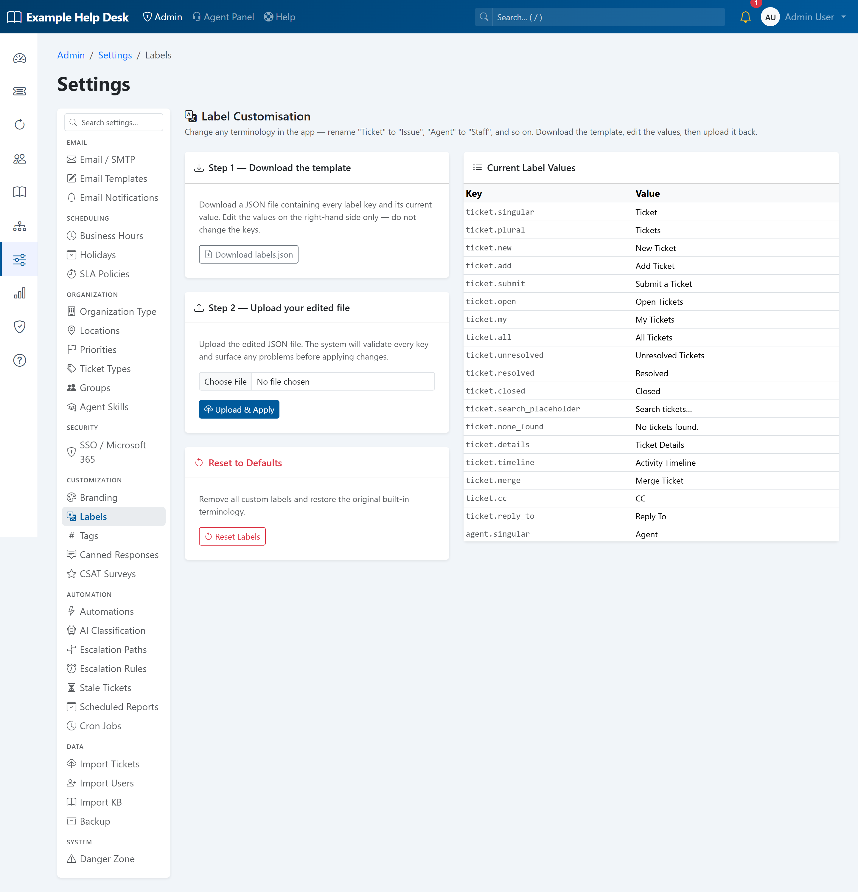
*Labels page — download the JSON, edit the values (not the keys), upload to apply. Customised values are highlighted yellow on the right-hand reference table.*

### 7.2 Application name & label customisation

**Application name** is set under **Settings → Branding** (covered next). It controls the navbar title, page titles, login page heading, and the From Name in emails (unless you override that separately).

**Label customisation** is at **Admin → Settings → Labels**. Every user-facing noun in the app — "Ticket", "Agent", "Location", "Group", "Tag", "Priority", "Knowledge Base" — is rendered through a `label('key', 'Default')` helper that reads from `config/labels.default.json` with overrides stored in the `settings` table. Rename "Location" to "Branch" or "Site"; rename "Ticket" to "Issue" or "Request"; rename "Agent" to "Staff" or "Tech".

The workflow:

1. Download the current label JSON from **Step 1 — Download the template**. The file contains every label key with its current value.
2. Edit the **values** only. Do not change the keys — they're referenced from PHP and JavaScript.
3. Upload the edited file at **Step 2 — Upload your edited file**. The server validates every key before applying changes and surfaces problems inline.
4. If you ever want to revert, **Reset to Defaults** wipes your overrides and restores the originals.

The right-hand column shows the current value of every label, with overridden ones highlighted yellow.

### 7.3 Branding

**Admin → Settings → Branding**. A two-column page: form on the left, live preview on the right that updates as you type.


*Branding settings — logo, fallback icon, colour scheme, and timeline highlight colours, with a live preview that updates as you type.*

What you can change:

- **Logo** — JPG, PNG, GIF, WEBP, or SVG. Max 2 MB, recommended height 32–40 px. Replaces the navbar icon on every page; the preview shows what the navbar will look like before you save.
- **Fallback icon** — any [Bootstrap Icon](https://icons.getbootstrap.com/) class name (e.g. `bi-display`, `bi-laptop`, `bi-building`). Shown when no logo is uploaded.
- **Application name** — display name in the navbar, titles, login, and emails.
- **Primary colour** — buttons, links, active states. Default `#4f46e5` (indigo).
- **Primary hover** — the darker shade used on hover/focus. Default `#4338ca`.
- **Navbar gradient start / end** — the two colours of the top bar's left-to-right gradient. Defaults to dark indigo (`#1e1b4b` → `#312e81`).
- **Timeline note background / accent** — the highlight colour for internal notes on the ticket timeline. Default cream + amber.
- **Timeline system background / accent** — the highlight for automation entries (SLA changes, auto-assignments). Default pale blue.

There's a **Reset to Defaults** button for the main colours and a separate **Reset Timeline to Defaults** for the timeline pair. Saved branding takes effect on the next page load — no cache to bust.

### 7.4 Business hours & timezone

**Admin → Settings → Business Hours**.

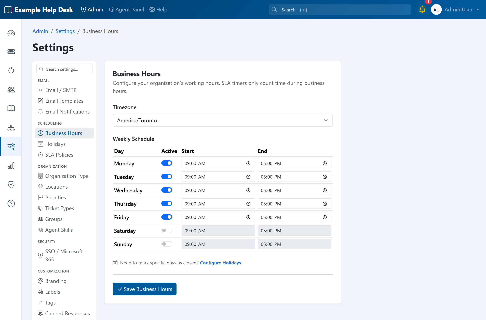
*Business hours — pick a timezone, then toggle each weekday on/off with start/end times. SLA timers only count time inside these hours.*

This is the single most important setting if you have an SLA in mind. SLA timers only count time during business hours, so if you set "First response = 60 minutes" but never tell OpenHelpDesk when you're open, every ticket created after 5pm will look on-track until the next morning.

Two pieces:

- **Timezone** — pick from the curated list (America/New_York, America/Toronto, Europe/London, etc., plus UTC). This is the helpdesk-wide default.
- **Weekly schedule** — toggle each day on, then pick start and end times. Defaults to Mon–Fri 09:00–17:00.

Save and the SLA engine immediately starts using these hours for future calculations. To re-apply to existing tickets, go to **Settings → SLA Policies** and click **Recalculate All**.

#### Per-location overrides

If you have branches in different timezones (e.g. a Toronto headquarters and a Vancouver branch):

1. Go to **Admin → Locations** and switch the radio button at the top from "All my Locations are in the same timezone" to **"Each Location has its own timezone"**, then save.
2. *Now* edit each location — a timezone select appears that wasn't there before. (The shared-timezone mode hides it deliberately to keep the form tidy for single-timezone installs.)

Tickets created at that location will use the local timezone for SLA calculations.

### 7.5 Holidays & closed days

**Admin → Settings → Holidays**.

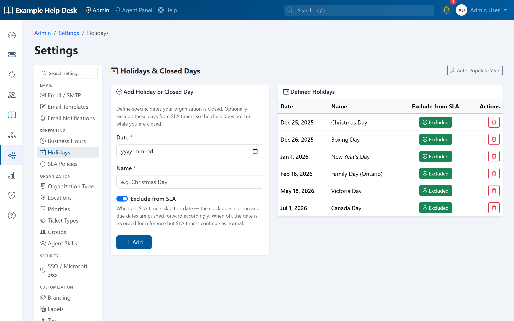
*Holidays page — add a date, mark whether SLA should skip it, or use Auto-Populate Year to insert every federal holiday for the chosen country.*

Tell the system which dates your team is closed so SLA timers skip them. The page has two sides:

- **Add Holiday or Closed Day** (left) — date, name, and a toggle for **Exclude from SLA**. If off, the date is recorded for reference but SLA timers continue normally.
- **Defined Holidays** (right) — the list of saved dates, each with a per-row toggle so you can flip "Exclude from SLA" without re-adding the holiday.

For convenience, **Auto-Populate Year** opens a modal that lets you pick a country (CA, US, GB, AU, NZ, IE) and a year, and inserts every federal / provincial holiday for that year in one click. Variable-date holidays like Easter are calculated for the exact year. Dates already in your list are skipped, not duplicated. Holidays added via auto-populate are flagged "Exclude from SLA" by default.

> The escalation cron and stale-ticket cron also respect business hours and holidays — a "3-day customer follow-up" rule won't fire on a weekend if Saturday and Sunday aren't business days.

---

## 8. Organisational structure

OpenHelpDesk's data model is small. Six entities cover the org chart:

| Entity | Purpose |
|---|---|
| **Location** | Physical site or department (e.g. Main Branch, IT Department). Tickets and users can have one. Optional. Per-location timezone for SLA. |
| **Ticket Type** | Category (IT, Facilities, HR, …). Drives the default group, the required-skills set for routing, and the confidential flag. |
| **Priority** | Urgency tier (Low, Medium, High, Critical). Links to an SLA policy. |
| **Tag** | Free-form classification (`hardware`, `network`, `printing`). Multiple per ticket. |
| **Group** | Team of agents (IT Support, Facilities, Reference Desk). Drives ticket visibility for agents and auto-assignment strategy. |
| **User** | Person with credentials. One of four roles: Admin, Power User, Agent, User. |

Configure them in roughly that order. Each one references the ones before it.

### 8.1 Locations

**Admin → Locations** (or **Settings → Locations** depending on your menu vocabulary).

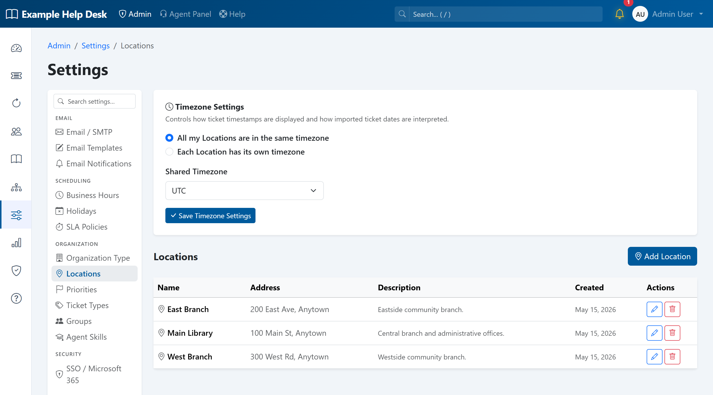
*Locations — each row has a name, optional timezone override, and a count of users / tickets attached.*

A location can be a branch, a department, a building, a remote office — anything you want to group tickets and users by. Optional but recommended once you have more than one physical site, because:

- Users can be assigned to a location; their submitted tickets inherit it.
- Locations can have a per-location timezone used for SLA calculation — but the timezone field is only visible after you switch the toggle at the top of the Locations page from "All my Locations are in the same timezone" to **"Each Location has its own timezone"**. See [Section 7.4](#74-business-hours--timezone).
- The ticket list can be filtered by location.
- Reports can be sliced by location ("By Location" report).
- The label "Location" itself can be renamed via the Labels page (so "Branch", "Site", "Department" all work).

When a user has the **Location Ticket Visibility** flag, they can view *all* tickets at the same location — useful for branch supervisors who need visibility without being made agents.

### 8.2 Ticket types

**Admin → Types** (or **Admin → Settings → Ticket Types**).

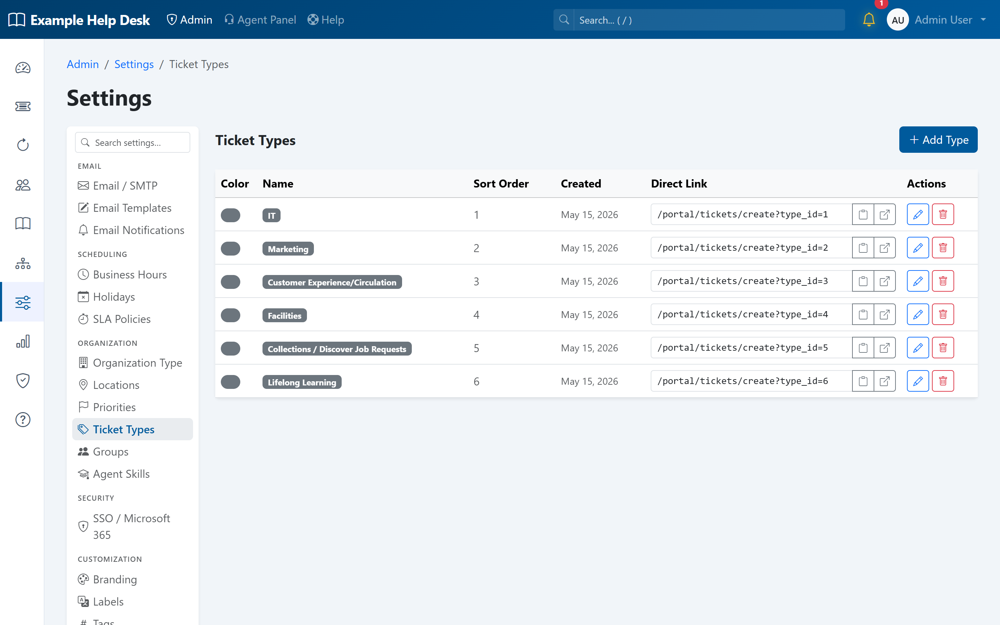
*Ticket types — each row shows the colour swatch, default group, required-skills count, and the confidential / "No Wrong Door" flags.*

A ticket type is the top-level "what kind of request is this" category. Common examples for a library: IT, Facilities, Cataloguing, Programming, HR, Privacy & Confidential. Each type has:

| Field | Purpose |
|---|---|
| **Name** | Display label. |
| **Colour** | Used on the ticket list and the SLA-policies-per-type tab. |
| **Sort order** | Numeric — controls the order types appear in dropdowns and lists. Lower numbers float to the top. |
| **Default group** | The group new tickets of this type get routed to (unless the creator picks a different group). Set this if you want type-based auto-routing. |
| **Required skills** | Zero or more skills from the global catalogue (see [Agent skills](#86-agent-skills)). Used by the Skill-Based auto-assignment strategy: only group members holding all required skills are eligible. |
| **Confidential** | When on, tickets of this type are hidden from agents outside the type's group, redacted in admin lists for admins outside the group, and require password re-authentication for admins to view. **Confidential tickets are never sent to AI providers.** See [Confidential groups & types](#85-groups) below. **The Confidential checkbox is disabled until a Default Group is selected** — a confidential type without a group has no meaningful "inside vs outside the group" scope. |
| **No Wrong Door** | (Internal field name: `ai_route_group`.) When on, the AI router (if enabled) reads the ticket body and picks the best-matching group from your configured groups' descriptions. Mutually exclusive with Confidential. See [AI](#14-ai-ticket-triage-optional). |
| **AI duplicate check** | When on, the AI scans recent open non-confidential tickets at the same branch when a requester clicks Submit and warns if any look like the same issue. Useful at multi-shift sites where staff don't see what's already in the queue. Has a separate **threshold** slider for match-confidence floor. Requires AI to be enabled. |
| **Show to "Location Ticket Visibility" users** | When on, a non-agent user with the *Location Ticket Visibility* flag can see tickets of this type at their location. Off means even location-visible users don't see this type. Useful for sensitive categories. |
| **Stale-ticket override** | Override the global stale-ticket threshold for this type (e.g. give "Facilities" a 7-day threshold instead of the global 3-day). |
| **Escalation path** | Per-type ordered chain of agents the manual **Escalate** button rotates through. See [Manual escalation paths](#132-manual-escalation-paths). |

Create your first three or four types now. You can always add more later.

### 8.3 Priorities

**Admin → Priorities**.

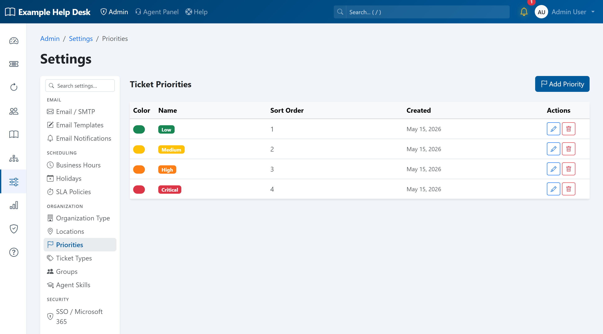
*Priorities — the four seeded tiers, each with a colour and sort order. Drag rows to reorder.*

Four priorities are seeded by the installer: Low, Medium, High, Critical, each with a colour. You can edit, reorder, or add more (e.g. an "Emergency" tier above Critical). Each priority can be linked to an SLA policy — that's how the SLA policy applies to a given ticket.

> Internally these are stored in the `ticket_priorities` table — relevant only if you're writing custom reports or poking the database directly.

If you want fewer than four tiers, delete or rename the ones you don't want — but do it *before* tickets pile up against those priorities.

### 8.4 Tags

**Admin → Settings → Tags** (or **Admin → Tags** depending on your sidebar layout).

Tags are free-form labels that classify tickets. Unlike types, a ticket can have many tags. Use them for cross-cutting attributes: `hardware`, `software`, `account-locked`, `wifi`, `printer`, `vendor-vendorname`. Tags drive search and filtering.

### 8.5 Groups

**Admin → Groups** (or **Admin → Settings → Groups**).

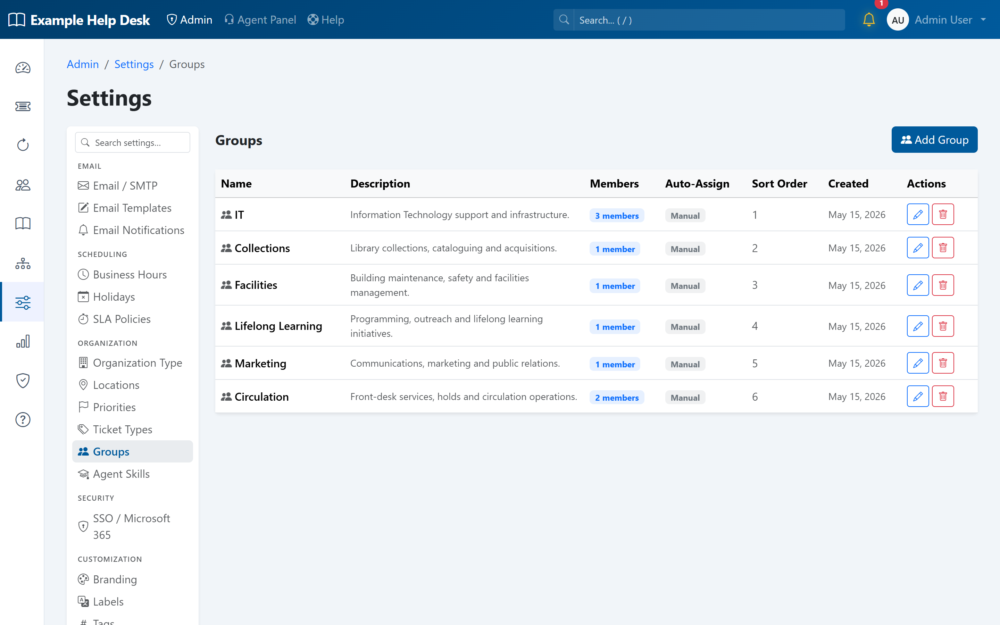
*Groups — each row shows member count, auto-assignment strategy, and the confidential flag (lock icon) when on.*

A group is a team of agents and admins. Two things happen when you put an agent in groups:

1. **Visibility narrows.** An agent who belongs to one or more groups sees only tickets assigned to those groups. An agent who belongs to no groups sees everything. Admins always see everything.
2. **Auto-assignment becomes possible.** Each group picks one of six strategies for how new tickets are distributed among its members.

#### Auto-assignment strategies

| Strategy | Behaviour |
|---|---|
| **Manual** *(default)* | Do nothing — leave the ticket unassigned for an agent to claim. |
| **Round Robin** | Rotate sequentially through group members. Distribution is even by ticket count. |
| **Load-Based** | Pick the member with the fewest currently-open tickets. Best when work items vary in length. |
| **Skill-Based** | Pick a member whose declared skills cover **every** skill required by the ticket type. Least-loaded among them wins. Falls back to the group's configured fallback when nobody qualifies. |
| **First Available** | Pick a member who currently has the app open in a browser (their `/api/presence` heartbeat fired in the last ~2 minutes). Good for shift / follow-the-sun coverage. Falls back when nobody is online. |
| **AI Skill-Based** | Same as Skill-Based, but an LLM reads the ticket's actual subject + body and infers which skills it needs, instead of using the ticket type's pre-declared required-skills. See [Section 14](#14-ai-ticket-triage-optional). |

Both Skill-Based and First Available can come up empty. Each group has a separate **Fallback** setting that decides what to do in that case: **Load-Based** (default), **Round Robin**, or **Leave Unassigned**.

#### Group managers

Inside each group's edit form, every member has a **Manager** sub-checkbox. Tick it for the people who should be allowed to:

- Maintain agent skills that the group owns (the "ILS" skill, the "French" skill, etc.) — create, rename, delete, and assign them to teammates without going through an admin.
- See a **Manage My Team** link in their avatar menu that lands them on a per-group skill grid at `/manager`.

Managers cannot edit global skills, edit skills owned by other groups, modify which skills a ticket type requires, or change group membership. Those decisions stay with the admin.

#### Confidential groups

Any group can be marked **Confidential** to enable a layer of security around its membership and the tickets routed to it:

- **Membership change alerts** — when members are added to a confidential group, existing members receive an email naming the new member, the admin who made the change, their email, IP, and timestamp.
- **Membership audit log** — every add/remove attempt is logged before the database write, so attempted changes are preserved even if they later fail.
- **Add-member confirmation dialog** — when adding new members, a modal warns the admin and requires explicit confirmation.
- **CSRF failure logging** — invalid CSRF tokens on confidential-group forms are logged as a possible attack indicator.
- **Linked ticket types** — when a ticket type is linked to a confidential group, agents outside the group cannot view its tickets at all, and admins outside the group see the ticket redacted (subject + details hidden) in lists and must re-enter their password to open it.

Use confidential mode for HR investigations, security incidents, or anything else where membership-level secrecy matters. Removing the flag, or deleting a confidential group, requires password re-authentication and notifies the existing members.

### 8.6 Agent skills

**Admin → Skills** (or **Admin → Settings → Agent Skills**).

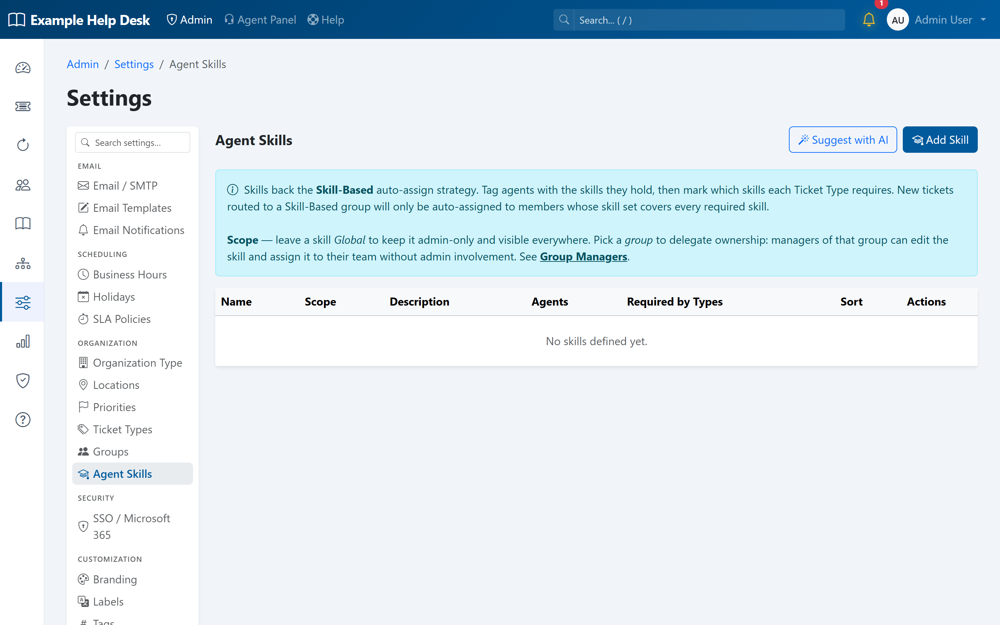
*Agent skills catalogue — global (admin-owned) and group-scoped skills, ready to be assigned to agents and required by ticket types.*

A skill is an admin- or manager-curated label (e.g. "Billing", "Network", "French", "Cataloguing", "ILS") that agents can hold. Skills drive the [Skill-Based](#85-groups) and AI Skill-Based auto-assignment strategies.

Each skill has:

- **Name** and optional description.
- **Sort order** for the catalogue.
- **Scope** — either **Global** (admin-curated, visible everywhere) or **Owned by a group** (delegated to that group's managers).

You assign skills to agents from the **Edit User** page. The Skill-Based strategy uses the intersection of agent skills with the ticket type's **Required skills** to decide who's eligible.

### 8.7 Users

**Admin → Users**.

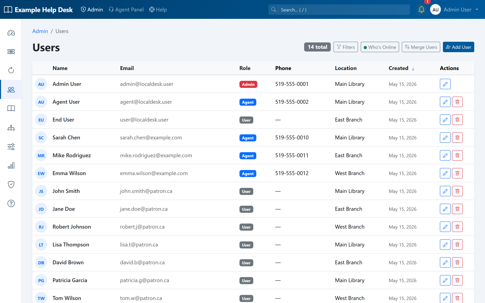
*Users list — every account with role, group memberships, location, 2FA badge, and Active / Inactive state. The filter panel on the left narrows by role or status.*

Four roles, in increasing power:

| Role | What they can do |
|---|---|
| **User** | Submit tickets and reply on the portal. Cannot log in to admin/agent surfaces. |
| **Agent** | Work tickets — internal notes, replies, status, priority, assignment. Sees only tickets in their groups (or all tickets if they belong to no groups). |
| **Power User** | Everything an agent can do plus access to reports & analytics. Cannot manage settings or other users. |
| **Admin** | Everything. |

The fields you can set per user are split across two forms:

- **Add User** form (create only) — name, email, role, location, optional avatar and work phone, password, and **Location Ticket Visibility** (let a non-agent see all tickets at their location).
- **Edit User** form (after the user exists) — everything above plus **group memberships**, **agent skills**, **2FA reset**, **password reset** (send reset link), and the **Active / Inactive** toggle to disable a login without deleting history.

When you create a user, a temporary password is set and a welcome email is sent (if SMTP is configured) with login instructions.

#### Deleting users

If a user has associated tickets or KB articles, the delete form makes you choose between **Transfer records** (move to another user — search by name/email) or **Delete all records** (permanently remove the user's tickets, notes, KB articles). The ticket count and article count are clickable so you can review what's about to be moved or destroyed in a new tab.

#### Online presence

Every authenticated user's browser pings `/api/presence` every 30 seconds for the lifetime of the tab. Anyone whose last ping was within ~2 minutes is considered online and appears live at **Admin → Users → Who's Online**. The same data feeds the First Available auto-assignment strategy. No manual "I'm available" toggle — close the tab to go offline.

### 8.8 Self-registration & email verification

End users can register themselves via the portal login page (`/login` → **Sign up**). New self-registered accounts get the **User** role by default and must verify their email address before logging in. To grant Agent or Admin access, an admin must promote the account afterward.

You can disable self-registration entirely by editing `src/routes.php` (the relevant route is well-commented), or in practice you can leave it open — verified email plus User-only role means there's no abuse surface beyond opening a ticket.

---

## 9. SLA policies

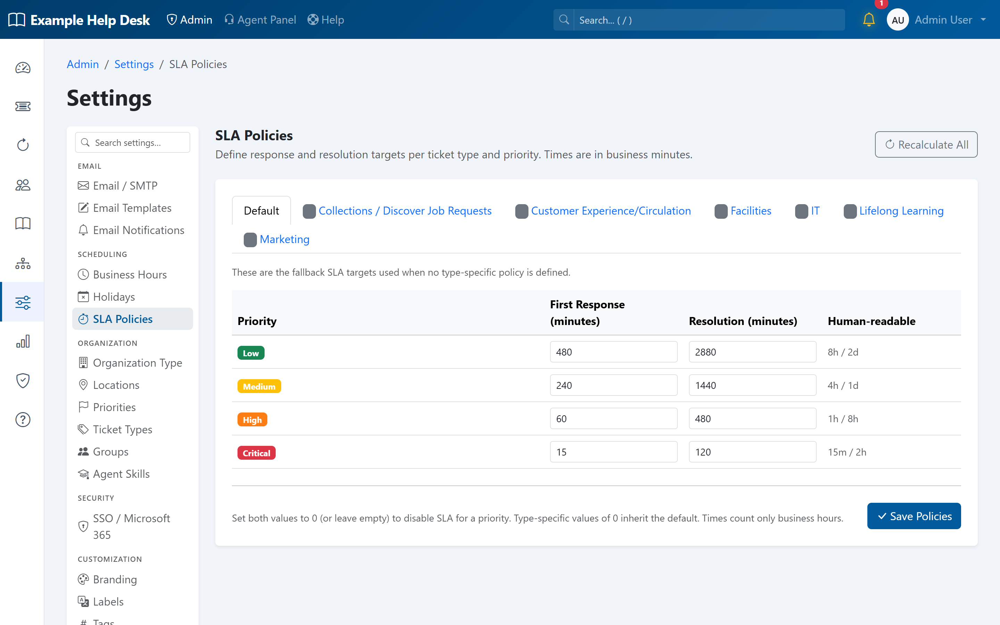
*SLA Policies — tabbed by ticket type plus a Default tab. Each tab shows First Response and Resolution targets per priority, with a live "Human-readable" preview.*

A Service Level Agreement (SLA) policy defines two time targets per ticket:

- **First Response** — how long after creation an agent must post their first public reply.
- **Resolution** — how long after creation the ticket must be marked resolved or closed.

Both are measured in **business minutes** — i.e. they count only time within your configured business hours and skip days marked "Exclude from SLA" on the Holidays page.

### Configuring policies

**Admin → Settings → SLA Policies**.

The page is a tabbed grid: one tab per ticket type plus a **Default** tab. Inside each tab is a four-column table:

| Column | Meaning |
|---|---|
| Priority | The badge for the priority tier. |
| First Response (minutes) | How long the team has to send the first public reply. |
| Resolution (minutes) | How long the team has to resolve the ticket. |
| Human-readable | Live preview: "60m" / "8h" / "1d 2h" — confirms what you typed. |

The **Default** tab is the fallback — it's used whenever a ticket's type doesn't have a per-type override for its priority. Per-type tabs let you tighten or loosen targets for specific types ("Facilities — Critical = 30 min response, 4 h resolution"; "Cataloguing — everything is 1 business day").

Set both fields to **0** (or leave blank) to disable SLA for a priority. Per-type values of 0 inherit the Default tab's value for that priority.

A "Recalculate All" button at the top right opens a modal that re-runs SLA calculation for every active ticket immediately. Use this after big changes (e.g. you adjusted business hours from 9–5 to 8–6, or you bulk-added a new priority).

### How timers behave

- Deadlines are calculated from `created_at`.
- The first-response timer **stops** when an agent adds a public reply (internal notes don't count).
- The resolution timer **stops** when the ticket moves to Resolved or Closed.
- Timers go **amber** when 80% consumed, **red** when breached.
- Timers pause when the ticket is in **Pending**, **Waiting on Customer**, or **Waiting on Third Party**, and resume when it moves back to Open / In Progress.
- Changing priority re-evaluates the SLA: if the new priority maps to a different policy, the timer is re-initialised from "now" with new deadlines, and an `SLA Set` entry is added to the timeline.

Recalc cadence: the [cron job](#6-cron-jobs--critical-post-install-step) at `*/5` runs `public/sla-cron.php`, which iterates every active ticket and updates state. Even without cron the state is also calculated on each ticket-detail page load, so the live ticket view always shows the right colour — cron just ensures lists and KPI cards reflect the latest state without a click.

---

## 10. Ticket routing & auto-assignment

Routing is the chain of decisions that take a brand-new ticket and figure out (a) which group should handle it and (b) which member of that group should be assigned. Both are configurable, with safe defaults.

### 10.1 Picking the group

Every creation path — portal form, agent / admin forms, ticket-split, public REST API, email-to-ticket, CSV import — resolves the group by walking this chain in order:

1. **Explicit caller pick** — whatever group the creator (or API client) chose. Wins immediately.
2. **Ticket type's default group** — set per type at **Admin → Types → Edit**.
3. **System default group** — set at **Admin → Settings → Ticket Routing Defaults**.
4. **Lowest-id existing group** — a last-resort safety net.

Two more safety nets fire after the ticket is in the database:

- After post-create hooks (automations + AI classification) have run, if the ticket still has no group, a final sweep routes it to the system default.
- The hourly stale-ticket cron catches any orphan that slipped through and logs a warning — so a misconfiguration can never silently park tickets in an invisible "no group" queue.

Configure the system default at **Admin → Settings → Ticket Routing Defaults**. Best practice: create (or designate) a generic *Triage* or *Service Desk* group, set its auto-assignment strategy to **Load-Based** or **First Available**, and point the system default at it. That way the catch-all queue is also auto-distributed to a human.

### 10.2 Picking the assignee

Once the group is set, the [auto-assignment strategy](#85-groups) on that group decides who gets the ticket. Recap:

| Strategy | One-liner |
|---|---|
| **Manual** | Leave unassigned. |
| **Round Robin** | Even rotation. |
| **Load-Based** | Fewest open tickets wins. |
| **Skill-Based** | Match ticket-type required skills against agent skills; least-loaded among qualified agents wins. |
| **First Available** | Match against who's currently online (`/api/presence` heartbeat within 2 minutes); least-loaded among online wins. |
| **AI Skill-Based** | LLM reads the ticket body and infers needed skills, then routes like Skill-Based. |

Manual assignment is never overridden by auto-assignment — if you set an assignee in the create form, that wins. Auto-assignment only fires when the group is set but the assignee is blank.

Auto-assignment also fires **on first public reply**: if a ticket was created without an assignee and the first public reply comes from an agent or admin, that person is auto-assigned. This is the "I picked it up because I replied" rule and it works whether or not your groups use an auto-assignment strategy.

---

## 11. Inbound email

OpenHelpDesk can do four inbound-email things, in roughly increasing setup complexity:

| Feature | What it does | Backend |
|---|---|---|
| **Reply-by-email** | A user replies to a notification email; the reply lands as a comment on the matching ticket. | IMAP **or** Microsoft Graph |
| **Email-to-Ticket** | An email sent to your helpdesk mailbox that *isn't* a reply to anything becomes a new ticket. | Microsoft Graph only |
| **Hashtag commands** | An agent's email reply with `#close` / `#resolve` / etc. updates the ticket state. | Built into both backends |
| **Email notifications out** | Ticket-created, ticket-updated, @mention, customer-reminder, escalation, CSAT survey, etc. | SMTP only (covered in [Section 7.1](#71-email--smtp)) |

All of this is optional. You can run OpenHelpDesk perfectly well with no inbound email at all — users just visit the portal.

### 11.1 Email-to-Ticket

**Admin → Settings** → **Email-to-Ticket** card.

When enabled, emails sent to your helpdesk mailbox that are *not* replies to existing tickets are converted into new tickets. The same mailbox configured in [Section 11.2](#112-reply-processing--microsoft-graph-api) is used.

Settings:

- **Enable Email-to-Ticket** toggle.
- **Auto-create user accounts** — if the sender's email isn't a registered user, create a portal account for them. With this off, emails from unknown senders are skipped (which is sometimes what you want — e.g. when you only handle internal email).
- **Default Ticket Type** — what type to assign. Useful with the **No Wrong Door** flag if you want all unknown email to start in "Unclassified" and let AI re-route it.
- **Default Priority** — what priority to assign. Leave blank to mean "no priority" (the ticket appears in lists with `—` for priority).

The email subject becomes the ticket subject; the email body (text or HTML, cleaned of signatures and tracking pixels) becomes the description. Attachments are attached to the ticket.

### 11.2 Reply processing — Microsoft Graph API

The recommended modern path. Uses OAuth 2.0 client credentials — no IMAP, no app passwords, no interactive sign-in.

**Admin → Settings → Inbound Mail — Reply Processing.** The **Setup Guide** button on that card links to a step-by-step Azure walkthrough at `/admin/settings/email-reply-help`.

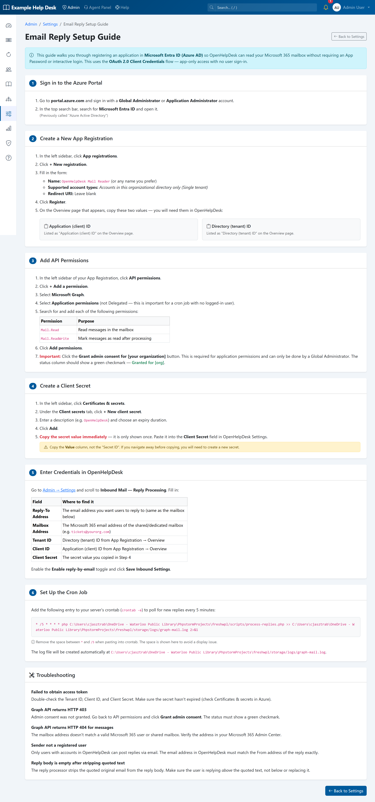
*The in-app setup guide walks through every Azure step: app registration, API permissions (`Mail.Read` + `Mail.ReadWrite`), client secret, and pasting credentials back into OpenHelpDesk.*

Summarised here:

1. **Sign in to the Azure Portal** (`portal.azure.com`) with a Global Administrator or Application Administrator account.
2. **Create a new App Registration**:
   - Name: anything (e.g. "OpenHelpDesk Mail Reader")
   - Supported account types: *Accounts in this organizational directory only (Single tenant)*
   - Redirect URI: leave blank.
   - Copy the **Application (client) ID** and **Directory (tenant) ID** from the Overview page.
3. **Add API permissions** — Microsoft Graph → **Application permissions** (not Delegated) → `Mail.Read` and `Mail.ReadWrite`. Then click **Grant admin consent for [your org]** — this is required and only a Global Admin can do it. The status column should turn green.
4. **Create a client secret** — Certificates & secrets → New client secret. **Copy the Value column immediately** (it's only shown once). Note the expiry date.
5. **Paste into OpenHelpDesk**: the Reply-To Address, the Mailbox Address (usually the same), the Tenant ID, Client ID, Client Secret, and the App Secret Expiry Date.
6. **Enable** the `Enable reply-by-email` toggle, save, and click **Run Now** to test. The output appears below the form — exit code 0 means it worked.

The app sends email reminders 30 days, 7 days, and on the day of secret expiry — set the expiry date so you don't get locked out when the secret rolls.

### 11.3 Reply processing — IMAP fallback

If you can't or don't want to use Microsoft Graph (e.g. you're on a non-Microsoft mail platform like Postfix or Zimbra, or you can't get an Azure admin to grant API permissions), IMAP works. There's no UI for it because it's the legacy path; see `scripts/process-replies.php` — the script will use IMAP credentials from the `settings` table if Graph is not configured.

Set `imap_host`, `imap_port`, `imap_username`, `imap_password`, `imap_encryption` directly via the database or use the legacy IMAP form if your version still has it. Most setups should prefer Graph.

### 11.4 Hashtag commands

When an agent or admin replies to a ticket notification email, the reply body is parsed for hashtag commands. Each command takes effect on the ticket before the reply is appended as a comment.

Common commands:

| Command | Effect |
|---|---|
| `#close` | Close the ticket. |
| `#resolve` | Mark the ticket Resolved. |
| `#open` / `#reopen` | Re-open a closed or resolved ticket. |
| `#pending` | Move to Pending. |
| `#waitcustomer` | Move to Waiting on Customer. |
| `#waiting3p` | Move to Waiting on Third Party. |
| `#priority:high` | Set priority by name (case-insensitive). |
| `#assign:alice@example.com` | Reassign to the matching user. |
| `#group:Facilities` | Move to the named group. |
| `#tag:network` | Add a tag. |

Only agents, power users and admins can run hashtag commands; portal users' hashtags are ignored. Each command is recorded as an internal timeline entry so the audit trail shows who did what from email.

---

## 12. Automations

**Admin → Automations**.

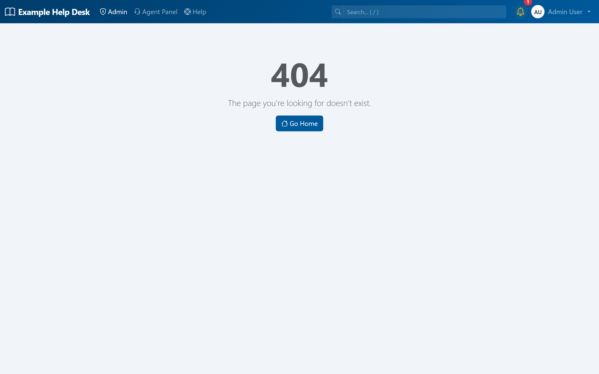
*Automations — event-driven rules listed in evaluation order. Drag to reorder; toggle Active per rule.*

An automation rule is an **event-driven** "when X happens, do Y" rule. (For *time*-driven rules — "after a ticket has been in Waiting on Customer for 3 days, do Y" — see [Escalation rules](#131-time-based-escalation-rules).)

Every rule has three parts:

| Part | What it does |
|---|---|
| **Trigger** | The event that causes the rule to be evaluated — Ticket Created, Ticket Updated, Reply Added, Status Changed. |
| **Conditions** | A nested AND/OR group of clauses that must all match. Fields: Subject, Description, Status, Priority, Assigned To, Location, Tag, Requester Email. Operators per field: contains / equals / is / in / not, etc. |
| **Actions** | One or more actions to perform when conditions match. Available: Assign to agent, Set priority, Set status, Add tag, Set location, Add internal note. |

Rules are evaluated in the order they appear in the list — drag rows to reorder. Multiple rules can fire on the same event; all matching rules run in sequence. Toggle a rule **Active / Inactive** with the on/off control on the right.

### Worked examples

**Auto-assign urgent tickets to a senior agent**

- Trigger: Ticket Created.
- Conditions: Priority **is** Critical.
- Actions: Assign to [Senior Agent].

**Tag IT requests**

- Trigger: Ticket Created.
- Conditions: Subject **contains** "computer" OR Subject **contains** "laptop" OR Description **contains** "printer".
- Actions: Add tag **hardware**, Set location **(reporter's location)** (if you have multi-site setups).

**Flag unassigned open tickets**

- Trigger: Ticket Updated.
- Conditions: Status **is** Open AND Assigned To **is unassigned**.
- Actions: Add internal note "Heads up — this ticket is still unassigned and Open."

Every automation action posts an internal timeline entry on the ticket so the audit trail shows which rule ran and when.

---

## 13. Escalations

OpenHelpDesk has three related-but-distinct escalation systems. They sit on top of each other; you can use any combination.

### 13.1 Time-based escalation rules

**Admin → Settings → Escalation Rules.**

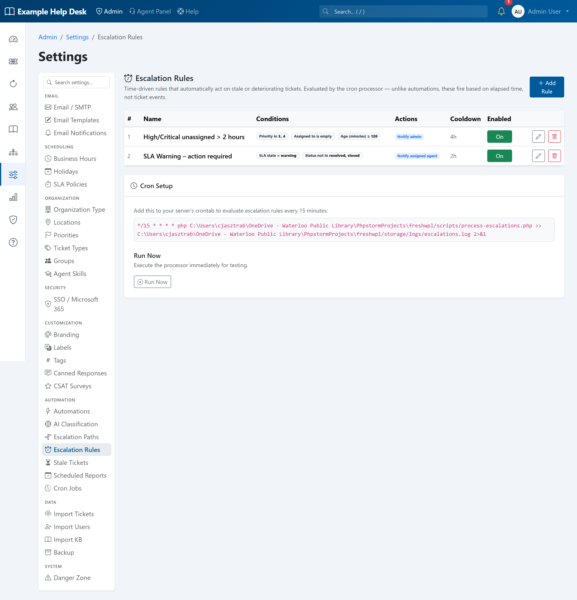
*Escalation rules — time-driven rules fire from cron. Each row shows conditions, actions, cooldown, and an on/off toggle. The Run Now button at the bottom triggers the cron immediately for testing.*

Time-based rules fire from cron (`scripts/process-escalations.php`, default every 15 minutes). Each rule has:

| Part | What it does |
|---|---|
| **Name** | Display name. |
| **Conditions** | Nested AND/OR clauses on `sla_state`, `hours_open`, `hours_since_update`, `hours_in_status`, `is_assigned`, `priority`, `status`, `group_id`, `assigned_to`, `type_id`, `location_id`. |
| **Actions** | Set priority, Assign to (agent), Set group, Set status, Notify user, Notify assigned agent, Notify admin, Add internal note. |
| **Cooldown (hours)** | Minimum gap before the same rule can fire on the same ticket again. Set to 0 for "fire once and never again". |
| **Enabled** | Single on/off toggle. |

The rules table on this page also shows a **Cron Setup** card with the absolute crontab line and a **Run Now** button — useful for testing a new rule without waiting 15 minutes.

#### Worked example: 3-day customer follow-up

Send the requester a polite reminder if they've been in Waiting on Customer for three business days:

1. Add Rule.
2. Conditions: Status **is** Waiting on Customer AND Hours in status **≥** 72.
3. Actions: Notify user (uses the **Customer Reminder** email template).
4. Cooldown: 72 hours (so they get reminded every 3 days, not every cron tick).
5. Enable.

The Customer Reminder email content lives at **Admin → Settings → Email Templates → Customer Reminder**. Tokens available include `{{first_name}}`, `{{ticket_id}}`, `{{subject}}`.

### 13.2 Manual escalation paths

**Admin → Settings → Escalation Paths.**

A manual escalation path drives the red **Escalate** button on the ticket view. Each ticket *type* has its own ordered chain of agents (e.g. Tier 1 → Tier 2 → Manager). When someone clicks Escalate, the ticket reassigns to the next agent in the chain, the previous assignee stays on as a watcher, and the event is logged.

Configure a path:

1. **Admin → Settings → Escalation Paths.**
2. Pick a ticket type.
3. Add agents to the chain in order. Each step is one user plus an optional label like "Tier 2 Lead".
4. Drag rows to reorder.
5. Save.

Who can click Escalate:

- **Agents, power users, admins** — see the button on every ticket they can access.
- **Portal users (requesters)** — see the button on tickets they themselves submitted, so they can self-escalate when they feel a response has stalled.

If the current assignee already appears in the chain (they *are* Tier 2), Escalate skips ahead to the step **after** them rather than looping back. On escalation the previous assignee is added as a watcher (so they keep email visibility even if the ticket leaves their group), the new assignee receives the dedicated **Ticket Escalated** email template, and an internal timeline entry is recorded.

### 13.3 Stale ticket notifications

**Admin → Settings → Stale Tickets.**

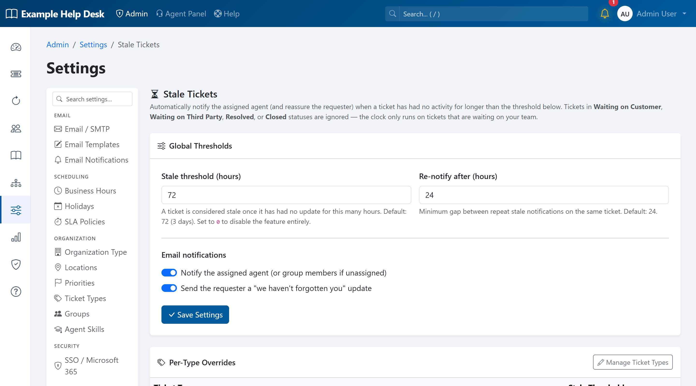
*Stale ticket settings — global threshold, re-notify gap, agent / requester toggles. Per-type overrides live on the Ticket Types page.*

Stale-ticket notifications email the assigned agent (or the group, if unassigned) when a ticket has had **no activity** for longer than the configured threshold and is in a status that's still waiting on your team. Tickets in Waiting on Customer, Waiting on Third Party, Resolved, or Closed are intentionally ignored — the clock only runs when the ball is in your court.

Settings:

- **Stale threshold (hours)** — default 72. Set to 0 to disable.
- **Re-notify after (hours)** — default 24. Minimum gap between repeat nags.
- **Notify the assigned agent** toggle.
- **Notify the requester** toggle (sends a "we haven't forgotten you" email).
- **Per-type override** on the Ticket Types page — override the global threshold per type.

The cron `0 * * * *` runs `scripts/process-stale-tickets.php`. Each notification posts an internal `stale_notification_sent` timeline entry to dedupe. Replying to or updating the ticket clears its staleness automatically (the threshold is measured from `updated_at`).

---

## 14. AI ticket triage (optional)

OpenHelpDesk can call out to **Anthropic Claude** or **OpenAI** on every new ticket to read the subject + body, decide which agent skills it needs, score the model's own confidence, and tag sentiment. The result feeds the routing engine — same flow as having a senior agent triage every ticket on arrival, only faster and 24/7. **You don't have to use it.** Auto-assignment works fine without AI; the Skill-Based strategy will use the ticket type's manually-declared required-skills.

### 14.1 What it does

On every new ticket:

1. Ticket arrives (portal, admin, REST API, or inbound email).
2. If AI is enabled **and** the ticket type is **not** marked Confidential, OpenHelpDesk sends the subject + body plus the candidate skill list (global skills + the destination group's skills) to the configured provider.
3. The provider returns JSON: a list of `skill_ids`, a confidence score 0.0–1.0, and a sentiment label (neutral / positive / frustrated / angry / urgent).
4. The result is stored in `ai_classifications` and pointed at by `tickets.ai_classification_id`.
5. If the destination group's strategy is **AI Skill-Based** **and** confidence ≥ the configured threshold, the routing engine picks the least-loaded group member who holds every suggested skill. Otherwise it falls through to the group's fallback (load-based, round-robin, or leave unassigned).
6. If the AI flagged sentiment as **angry** or **urgent** and the "bump priority" toggle is on, the ticket priority is bumped up one level and a timeline entry is recorded.

There's also a second AI flow — **No Wrong Door** — covered below, that picks the *group* before the skill flow runs.

### 14.2 Privacy & confidentiality

This is the first thing to understand.

- **Tickets whose type is marked Confidential are never sent to the AI provider.** The classifier short-circuits before any HTTP call. There is no exception, no override, no admin opt-in. Use the Confidential flag on ticket types that carry HR, security, or privacy content.
- Subjects are truncated to 200 characters and bodies to 4,000 characters before sending. HTML is stripped.
- API keys are stored in the `settings` table (same place as your SMTP password) and never displayed in clear text after the first save.
- Calls use HTTPS to `api.anthropic.com` or `api.openai.com`. Review each provider's data-handling policy for retention details — Anthropic and OpenAI both have enterprise-grade data-handling agreements available.

### 14.3 Choosing a provider

| Provider | Default model | Notes |
|---|---|---|
| **Anthropic Claude** *(recommended)* | `claude-haiku-4-5` | Fast, low cost, strong on classification. Switch to Sonnet 4.6 for trickier libraries with overlapping skill names. |
| **OpenAI** | `gpt-4o-mini` | Use if you already have an OpenAI account or need GPT-specific behaviour. Forces `response_format=json_object`. |

The model dropdown is auto-populated from each provider's API. Click **Refresh model list** after a provider releases something new — no code change needed.

#### Cost ballpark (Anthropic)

Approximate per-classification cost at ~500 input + ~100 output tokens (a typical ticket):

| Model | Per ticket | Per 1,000 tickets | When to use |
|---|---|---|---|
| `claude-haiku-4-5` *(recommended)* | ~$0.001 | ~$1 | Day-to-day classification. Fast and accurate enough. |
| `claude-sonnet-4-6` | ~$0.005 | ~$5 | If Haiku misclassifies on subtle, overlapping skill names. |
| `claude-opus-4-7` | ~$0.015 | ~$15 | Overkill for routine classification. Use only if you've measured Sonnet getting things wrong on real tickets. |

Default to Haiku unless you have evidence it's wrong. A fresh install picks Haiku; if you accidentally saved Opus, your $25 of credit will burn ~10× faster than necessary.

### 14.4 Setting it up

**Admin → Settings → AI Classification.**

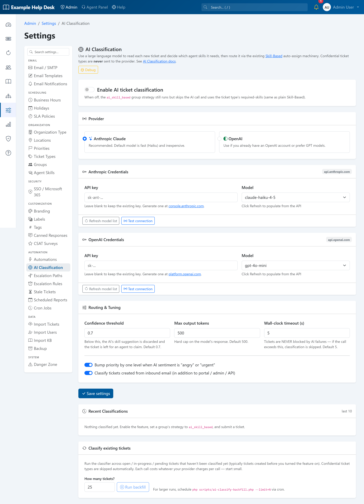
*AI Classification — master toggle, provider radio buttons, separate Anthropic and OpenAI credential cards with Refresh-model-list and Test-connection buttons, plus confidence / sentiment-bump / inbound-email tuning.*

1. Pick your provider (radio buttons at the top).
2. Paste the API key. Generate one at:
   - [console.anthropic.com](https://console.anthropic.com/) for Anthropic.
   - [platform.openai.com/api-keys](https://platform.openai.com/api-keys) for OpenAI.
3. Click **Refresh model list** — this also validates the key.
4. Pick a model from the dropdown.
5. Click **Test connection** — green success flash with the round-trip time means you're good.
6. Tune **Confidence threshold** (default `0.7`). Below this, the AI's suggestion is *stored* but *discarded for routing*; the ticket falls back to the group's fallback strategy or stays unassigned.
7. (Optional) Tune **Max output tokens** (default 500) and **Wall-clock timeout** in seconds (default 5). Tickets are **never** blocked by AI failures — if the call exceeds the timeout, classification is skipped and the ticket is created normally.
8. (Optional) Toggle **Bump priority by one level when AI sentiment is "angry" or "urgent"**.
9. (Optional) Toggle **Classify tickets created from inbound email** (in addition to portal / admin / API).
10. **Enable AI ticket classification** at the top of the page, save.
11. Edit the group(s) you want auto-routed: **Admin → Groups → Edit** → strategy = **AI Skill-Based**.

For groups that should also use the AI to route between groups (not just within a group), set the ticket type's **No Wrong Door** flag — see next.

### 14.5 "No Wrong Door" — let AI pick the group

Some patron requests don't fit a clear category. The skill classifier above picks *which agent* handles a ticket within a group it's already in; **No Wrong Door** adds a layer above that, picking *which group* handles the ticket in the first place.

When to use it:

- You have a generic portal entry like "I'm not sure who handles this" and want patrons to use it without picking a category.
- You want a single inbox for ambiguous requests but don't want a human triager to read each one — AI fans them out automatically.
- Your library has departments with clearly distinct domains (Branch IT, Cataloguing, Facilities, HR, Programming, etc.) and the body of a ticket usually makes the right group obvious.

How it works:

1. Edit a ticket type at **Admin → Types** and tick **Let AI route this to the best group ("No Wrong Door")**. The flag is mutually exclusive with **Confidential**.
2. Set the type's **Default Group** to your fallback queue — the team whose members handle anything AI couldn't route. Make sure it has agents in it.
3. At **Admin → Groups**, give every group that should be a routing candidate a **clear, specific description**. *This is the only signal AI uses to pick.* Groups with an empty description are excluded from the candidate pool.
4. When a patron submits a ticket of that type, AI receives the subject + body plus every non-confidential group's name & description and returns either a chosen group ID, or `null` if it can't decide. The ticket is moved to the chosen group **only if** confidence clears the same threshold the skill classifier uses (default 0.7). Below that — or if AI returns null — the ticket stays in the Default Group queue.
5. Once the group is settled, the existing skill classifier runs against *that* group's skills, and auto-assignment proceeds normally. A ticket can be routed to "Branch IT" by AI, then assigned to the on-shift Branch IT agent who holds the matching skill.

Every routing decision (apply or skip) is recorded in `ai_group_classifications` and surfaced as an **AI Group Routing** card on the ticket detail page, with badges:

- **Routed to *Group*** — green; AI picked confidently and the ticket was moved.
- **No confident match** — grey; AI returned `null`; ticket stayed in the Default Group.
- **Suggested *Group* (below threshold)** — amber; AI picked but confidence didn't clear the bar.

Use the audit trail to tune your group descriptions. If you keep seeing "Suggested X (below threshold)" pointing at the *right* group, your description for X is too vague to satisfy the threshold — sharpen it. If you see confident routes to the *wrong* group, the descriptions are misleading or overlapping.

### 14.6 Override & re-classify

Every ticket detail page has an **AI Classification** card in the sidebar. From there:

- **Override** — open a modal and tick the skills the ticket actually needs. Your selection replaces the AI's for routing; the original verdict stays on the record. Audit-logged as `ai_classification_override`.
- **Re-classify** — re-runs the AI call (e.g. after editing the subject/body). Creates a fresh row in `ai_classifications`; history is preserved.
- **Classify now** — appears on tickets that have no classification yet (e.g. AI was disabled when the ticket was created).

### 14.7 Backfilling existing tickets

Two ways to classify tickets created before AI was enabled:

- **UI button** at the bottom of the AI settings page — pick a batch size (1–200), click **Run backfill**. Bounded by PHP's request timeout, fine for batches up to ~25 with the default 5-second per-call cap. Confidential types are skipped automatically.
- **CLI / cron** for larger backfills:
  ```bash
  php scripts/ai-classify-backfill.php --limit=200 --dry-run
  php scripts/ai-classify-backfill.php --limit=200
  # Include resolved/closed for accuracy testing against historical data:
  php scripts/ai-classify-backfill.php --limit=500 --statuses=open,in_progress,pending,resolved,closed
  ```

### 14.8 Debugging connection issues

The orange **Debug** button on the AI settings page opens `/admin/settings/ai/debug`. It bypasses the classifier abstraction and makes raw HTTP calls so you see the full response — status code, response headers, body, latency, cURL error.

What it can tell you:

- **Models list only** — uses a free `GET /v1/models` endpoint that doesn't consume credits. If this works, your key is valid and your auth is fine.
- **Message only** — sends a tiny `POST /v1/messages` probe. Verifies billing. If this fails after Models works, the problem is billing / quota / spend cap, not auth.
- **Both** — runs both calls so you can see which one breaks.

Common errors and what they mean:

| Status | Message | Root cause |
|---|---|---|
| 200 | — | Working. If the classifier still fails, the issue is on OpenHelpDesk's side — check `storage/logs/php-error.log`. |
| 401 | Unauthorized | Wrong key, revoked key, or whitespace in the pasted value. Generate a new one. |
| 403 | Forbidden | Workspace permission issue or region block. |
| 400 | `credit balance is too low` | Workspace spend cap is $0 even though the org has credits. See below. |
| 404 | `model_not_found` | The saved model name is wrong or deprecated. Refresh the model list and re-pick. |
| 429 | `rate_limit` | Hitting the workspace's per-minute cap. Slow down or raise the cap. |
| 5xx | — | Provider is having problems. Try again in a few minutes. |
| 0 / cURL error | — | DNS, firewall, or outbound HTTPS blocked from the server. Test `curl https://api.anthropic.com` from the host shell. |

**Anthropic workspace spend cap gotcha.** Anthropic supports *workspaces* under your org. The org credit balance shows up on the billing page, but each workspace has its own monthly spend cap — and a freshly-created workspace defaults to **$0**. Result: you add $25 to your org, see "$25 remaining," but the API returns "credit balance is too low" because your API key is scoped to a workspace whose spend cap blocks every billable call. If Models list works on the debug page but Message returns the credit error, this is almost certainly it. Fix: Anthropic Console → Workspaces → click your workspace → Limits → set a monthly cap (or leave blank to inherit the org limit). Alternative: generate a new key in the Default workspace and paste it in.

### 14.9 Failure modes & resilience

- **Provider down or slow** — the call has a hard wall-clock timeout (default 5s). If exceeded, the ticket is created normally and routing falls back. No portal user ever sees an error from a misbehaving AI provider.
- **Bad JSON from the model** — falls back. Logged to PHP error log.
- **Skill ID hallucination** — the parser strips any IDs not in the candidate list before persisting. The model can't invent skills.
- **Confidence below threshold** — verdict is stored (for reporting / override) but skipped for routing.
- **API key missing** — the factory returns null; the feature is silently disabled until configured.

Every classification is audited: provider, model, latency, prompt + output token counts, and the raw provider response (for debugging). Internal timeline entries `ai_classified` / `ai_priority_bumped` / `ai_override` are added as appropriate.

---

## 15. CSAT surveys

**Admin → Settings → CSAT Surveys.**

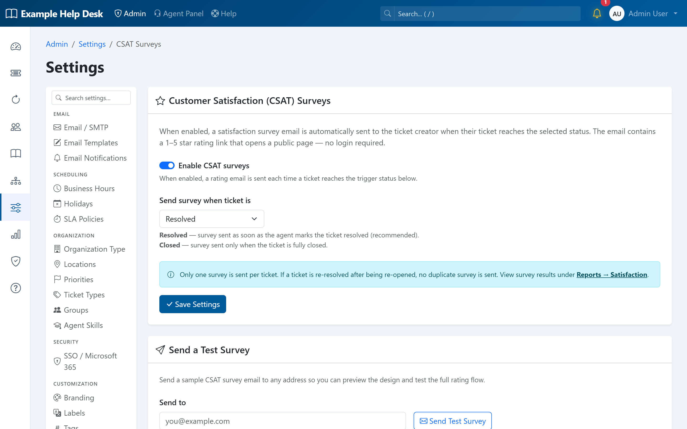
*CSAT — enable toggle, trigger status (Resolved or Closed), and a Send-Test-Survey card for previewing the email design.*

When enabled, a satisfaction survey email is automatically sent to the ticket requester when their ticket reaches the configured trigger status (Resolved or Closed). The email contains a 1–5-star rating link that opens a public page — no login required. Ratings and comments show up under **Admin → Reports → Satisfaction**.

Settings:

- **Enable CSAT surveys** toggle.
- **Send survey when ticket is** — Resolved (recommended) or Closed.
- Only **one** survey is sent per ticket. If a ticket is re-resolved after being re-opened, no duplicate survey is sent.

Use the **Send a Test Survey** card below to preview the email design and rating flow with your own address before turning it on for real users.

The email template can be customised at **Settings → Email Templates → CSAT Survey** (rich-text intro, button label).

### Verifying a response was saved

The survey email contains a public link of the form `https://your-helpdesk/survey/<64-hex-token>` — no login required. When the requester clicks a star and submits, the server writes the rating + optional comment back to the `csat_surveys` row and sets `responded_at = NOW()`. To confirm a specific response landed:

- Check **Admin → Reports → Satisfaction** — every ticket with a saved rating appears here with stars and a comment column. The page shows totals per agent, per group, and an overall average.
- Or query the database directly: `SELECT ticket_id, rating, comment, responded_at FROM csat_surveys ORDER BY responded_at DESC;`

If the email went out (`csat_surveys.sent_at` is set) but no row ever gets `responded_at` after the requester says they replied, the cause is almost always that the `APP_URL` in `.env` doesn't match the URL the requester actually has to reach the helpdesk on — the survey link in the email was baked from `APP_URL` and points somewhere unroutable.

---

## 16. Marking a comment as the solution

On a long-running ticket, the answer often ends up buried halfway down the timeline — six "we're looking into it" replies, an internal note or two, then the actual fix. Anyone who lands on the ticket later (a watcher, a CC, the requester returning to check, an agent picking up a re-opened ticket) has to scroll the whole conversation to find it.

This feature lets agents and admins flag a single timeline reply as the **ticket's solution**, and renders a green **Go to solution** jump-link near the top of the ticket detail page that anchors-and-scrolls to that comment.

### Marking and unmarking

On the agent and admin ticket detail pages, every customer-visible reply in the timeline shows a small **Mark as solution** button next to the timestamp. Click it; the page reloads with that comment flagged. The button on the marked comment toggles to **Unmark solution** so you can clear or reassign the flag at any time.

A ticket has at most one marked solution. Marking a different comment replaces the previous one — there's no separate "clear" step needed when you're picking a better answer.

The flag does *not* change ticket status. If you want the ticket moved to **Resolved** at the same time, do that separately from the status dropdown — keeping the two actions independent means you can flag the answer on a ticket that's still in **Waiting on Customer** (e.g. "here's what to try, let us know if it works") without prematurely closing the SLA clock.

### What changes when a comment is marked

- **Top of the page:** a green **Go to solution** alert appears below the ticket header, showing who posted the answer and when. Clicking it scrolls to the marked comment.
- **The marked comment:** picks up a green left border, a green **Solution** badge in the header line, and a brief highlight pulse when you land on it via the link.
- **Older-updates collapser:** the timeline collapses anything older than the most recent ten entries behind a **Show N older updates** button. The marked solution is **always force-shown** even if it would otherwise sit inside the collapsed range — otherwise the anchor would land on a `display:none` element and silently fail.

### Why internal notes can't be marked

Internal notes (`Add Note` rather than `Reply`) are visible only to agents and admins — the portal timeline filters them out entirely so the requester never sees them. If we let you mark one as the solution, two things would break:

1. The green **Go to solution** alert would render on the requester's portal view but the anchor would point at a comment that doesn't exist in their HTML, so the link would jump to nothing.
2. The very existence of the note would leak via the URL fragment (`#timeline-entry-12345`) even though the note's contents stay hidden.

So the **Mark as solution** button is intentionally absent on internal-note rows. Agent and admin views display a small muted hint in the slot the button would occupy — *"internal — can't be the solution"* — so it's clear the absence is by design rather than a missing feature. Reply publicly first if you want the note's content to be the answer of record.

The button is also absent on system events (Created, Status Changed, Assigned, AI Classified, etc.) — only `comment` rows authored by a person can be flagged.

### What the requester sees

On `/portal/tickets/{id}`, when a solution is marked the requester sees the same green alert at the top of the page — labelled **Answer available** rather than **Solution available** by default — and the marked reply gets the same green border and **Answer** badge in the timeline. There is no Mark / Unmark button on the portal; the requester is read-only on this flag.

The labels (`portal.solution.available`, `portal.solution.go`, `portal.solution.badge`) all run through the application label system, so if your team prefers **Solution** over **Answer** (or **Resolution**, or your own term) you can rename them at **Admin → Settings → Application name & labels**.

### A useful workflow pattern

For long support threads with multiple people CC'd, the typical flow is:

1. Agent replies publicly with the working fix.
2. Agent clicks **Mark as solution** on that reply.
3. Agent moves status to **Resolved** (or leaves it for the requester to confirm and close).
4. CSAT survey fires automatically (if §15 is enabled).
5. The requester returns to the ticket via the email link, sees the green **Go to answer** at the top, jumps straight to the fix without rereading the back-and-forth, and either marks the ticket closed or replies if they need more help.

The flag is purely informational and surface-level — there's no report on solutions, no count, no "% of tickets with a marked solution" metric. It's a navigation aid, not a workflow stage.

---

## 17. Custom ticket fields (form builder)

**Admin → Workflows → Ticket Fields** (`/admin/workflows/ticket-fields`).

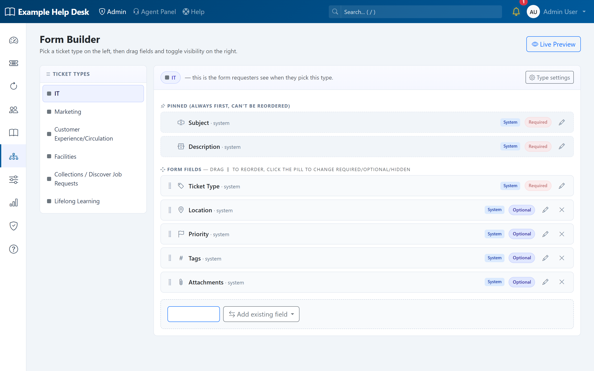
*Custom ticket fields builder — left column lists existing fields by type, right column edits the field's properties (label, required, staff-only, applies-to-types).*

A drag-and-drop builder for adding custom fields to tickets. Use it when the built-in fields (subject, description, type, priority, location, tags, attachments) don't capture something you need — e.g. an asset tag, a campus building number, a software version, a yes/no impact flag.

Supported field types:

| Kind | Notes |
|---|---|
| **Text** | Single-line input. Optional max length. |
| **Textarea** | Multi-line input. |
| **Dropdown** | Single-select. Define the option list. |
| **Multi-select** | Multiple checkboxes / chips. |
| **Checkbox** | Single boolean. |
| **Number** | Numeric input. |
| **Date** | Date picker. |

Per-field options:

- **Required** — block submission if empty.
- **Staff-only** — visible to agents and admins, hidden on the portal form.
- **Help text** — small inline hint shown below the field.
- **Appears on type(s)** — restrict the field to specific ticket types (so an "Asset tag" field doesn't appear on Facilities tickets).

Custom field values appear in a dedicated sidebar column on the ticket detail view, are searchable from the global search box, and are included in CSV exports.

> **Required-field gotcha.** A custom field marked Required is enforced server-side on every creation path — portal form, agent / admin create form, REST API, email-to-ticket, and CSV import alike. If you mark a field Required *after* tickets already exist, the existing tickets keep their NULL value and are not retroactively rejected, but every *new* ticket of that type must supply the field or submission fails with `<Field name> is required.`. Mark fields Required only when you genuinely cannot work the ticket without the answer (e.g. an "Asset Tag" field on IT tickets); over-strict required fields are the single most common cause of portal-form "Submit does nothing" complaints. Marking the field **Staff-only** instead bypasses the requirement on the portal form (since the field isn't shown there at all) while keeping agents accountable for filling it in once they pick up the ticket.

---

## 18. Ticket templates

**Admin → Ticket Templates** (`/admin/ticket-templates`).

A ticket template is a reusable pre-fill — subject, body, type, priority, optional tags. Use them for recurring request patterns:

- "New employee account setup" — pre-fills subject and a checklist body.
- "Software install request" — pre-fills with a structured body asking for the software name, license, business justification.
- "Conference room reservation issue" — pre-fills tags and the right group.

**Public-on-portal** templates appear as starting points on the portal **New Ticket** form, so end users can pick "New employee setup" instead of writing the whole thing themselves. Private templates are agent-only and appear on the agent / admin create forms.

---

## 19. Knowledge base

**Admin → KB → Articles** (`/admin/kb/articles`).

A three-tier hierarchy:

```
Category
└── Folder
    └── Article
```

Articles render Markdown and support a rich-text editor (CKEditor 5) with formatting, lists, links, images, code blocks, and tables.


*Admin Knowledge Base — categories / folders / articles, with public-flag and version-history support.*


*Article editor — rich-text WYSIWYG, with publish / draft state and per-article version history.*

### What the KB does for you

- **Inline suggestions when creating a ticket.** As a portal user types a subject (3+ characters), matching KB article titles appear below the field. The hope is they answer their own question and never submit the ticket.
- **Search** from the portal at `/portal/kb`.
- **Public Help Center.** Categories and articles can be marked public and browsed without logging in at `/kb`.
- **Article feedback.** Each article has a helpful / not-helpful prompt; results show up on the article admin page.
- **Version history.** Every save creates a revision. Admins can view diffs and restore prior versions.
- **CSV import** at **Admin → Settings → Import KB** — useful when migrating from an existing wiki.


*The public Help Center at `/kb` — branded and searchable, no login required.*


*A rendered KB article with helpful / not-helpful feedback prompt at the bottom.*

### Recommended initial categories

Start small. Three or four categories is plenty for the first month. For a library:

- "Wi-Fi & internet"
- "Library card & accounts"
- "Computers & printing"
- "Staff IT"

Add categories as patterns emerge from your real tickets. Every time you find yourself writing the same reply three times, that's a KB article.

---

## 20. Email templates

**Admin → Settings → Email Templates.**

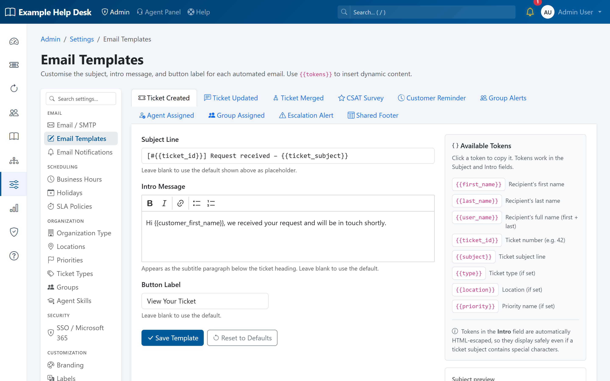
*Email templates — every outbound email type, plus the shared footer. Click any template to edit its subject, intro and button label.*

Six template types plus a shared footer:

| Template | When it sends |
|---|---|
| **Ticket Created** | On ticket creation, to the requester. |
| **Ticket Updated** | On public reply or status change, to involved parties. |
| **Ticket Merged** | When a ticket is merged into another, to the requester of the merged ticket. |
| **CSAT Survey** | On reaching the CSAT trigger status (Resolved or Closed). |
| **Customer Reminder** | From an escalation rule action — "Notify ticket creator". |
| **Group Alerts** | When a new ticket is assigned to a group, to all group members (optional, configured per group). |
| **Shared Footer** | Appended to every ticket email. Use for "do not reply below this line" disclaimers, social links, etc. |

Each template has an editable **subject**, **intro message** (CKEditor 5 rich-text), and **button label**. Use the **tokens panel** on the right to insert dynamic values: `{{first_name}}`, `{{last_name}}`, `{{ticket_id}}`, `{{subject}}`, `{{status}}`, `{{priority}}`, `{{ticket_url}}`, `{{agent_name}}`, etc.


*The email template editor — rich-text intro, dynamic token panel, live subject preview.*

A **Send Test** button on each template fires the rendered email to your address so you can see the final output, complete with branding, before anyone else does.

---

## 21. Scheduled reports

**Admin → Reports → Scheduled Reports** (or **Settings → Scheduled Reports**).

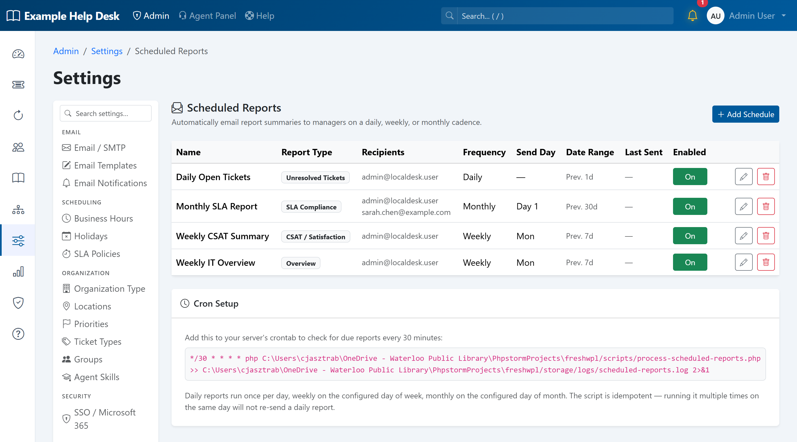
*Scheduled reports — every saved schedule with cadence, recipient list, and a Run Now button per row for ad-hoc delivery.*

Pick any built-in report (Agent Performance, SLA Compliance, Ticket Volume, etc.) or a Custom Builder report, attach a recipient list, pick a schedule (daily / weekly / monthly), and OpenHelpDesk will email the report on that cadence. The cron `*/30 * * * * scripts/process-scheduled-reports.php` is responsible for delivery — make sure it's in your crontab (see [Section 6](#6-cron-jobs--critical-post-install-step)).

Each report page also has a **Schedule** button at the top right that pre-fills the new-schedule form with whatever filters and date range you've already applied — so you can "schedule this view as a weekly report" without rebuilding it from scratch.


*Reports overview — twelve built-in reports plus the Custom Builder.*

---

## 22. Notifications & user preferences

### In-app notifications

The bell icon in the navbar polls `/api/notifications` every 15 seconds and shows an unread count badge. Click it to see the inbox: @mentions in ticket comments, escalation alerts, and system messages. Mark individually read by clicking, or **Mark all read** at the top.

@mentions work in any ticket comment or internal note. Type `@` and pick an agent / admin from the autocomplete dropdown. The mentioned user receives both an in-app notification *and* (by default) an email.

### Per-user email preferences

Each user can opt in / out of email categories from **My Profile → Notification Preferences**:

| Preference | Email fires when… |
|---|---|
| **New ticket assigned to me** | A ticket is assigned to the user. |
| **Ticket updated** | A public reply is added to a ticket they're involved with. |
| **@mentioned in a note** | Another agent @mentions them. |
| **My ticket assigned to an agent** | (Requester-side) Their ticket has been picked up. |

The site-wide outbound list — which emails are sent at all — is at **Admin → Settings → Email Notifications**. Use it to globally disable a category if you don't want it firing for anyone.

### Group email alerts

Each group can optionally email all of its members when a new ticket is assigned to the group. Toggle this on the group's edit form. Useful for low-volume groups where everyone wants visibility; turn it off for high-volume groups or each member's inbox will overflow.

### Microsoft Graph app-secret expiry reminders

If you use the Microsoft Graph inbound mail integration, the daily cron `0 8 * * * scripts/process-secret-reminders.php` sends email reminders to all administrators when the Graph app secret is approaching expiry — 30 days, 7 days, and on the day. Set the expiry date accurately at **Settings → Inbound Mail → App Secret Expiry Date** so the reminders fire on the right day.

### Per-ticket co-presence — "someone else is viewing this ticket"

A separate presence system runs **per ticket**, so two agents don't accidentally reply to the same customer at the same time or step on each other's notes. While an agent or admin has a ticket open, their browser POSTs to `/api/tickets/{id}/presence` every 15 seconds; the ticket detail page polls `/api/tickets/{id}/presence` for *other* current viewers and renders a dismissible banner that names them ("**Marcus Lee is also viewing this ticket**"). Records older than 45 seconds are pruned automatically, so closing the tab quietly clears the banner for everyone else within the next poll cycle.

This is distinct from the global online-presence list at **Admin → Users → Who's Online** (covered in [Section 8.7](#87-users)) — the latter shows who's logged in *anywhere* in the app, the former shows who is on *this specific ticket* right now. Portal users (User-role accounts) never trigger the per-ticket banner; only Admin, Agent and Power User sessions are counted.

---

## 23. Authentication — 2FA & Microsoft 365 SSO

### 22.1 Two-factor authentication (TOTP)

Admins and agents can enable TOTP 2FA from their own profile page:

1. Click your avatar (top right) → **My Profile** → **Security** → **Enable 2FA**.
2. Scan the QR code with Google Authenticator, Authy, 1Password, Microsoft Authenticator, etc.
3. Confirm with a 6-digit code from the app.

Once enabled, a 6-digit code is required on every login. If a user loses access to their authenticator, an admin can reset 2FA from **Admin → Users → Edit → Reset 2FA**.

Portal (User-role) accounts don't have 2FA — it's available only to Admin / Power User / Agent. This is intentional: portal accounts have very limited access (their own tickets), so the 2FA friction doesn't earn its keep.

### 22.2 Microsoft 365 SSO

**Admin → Settings → SSO / Microsoft 365.**

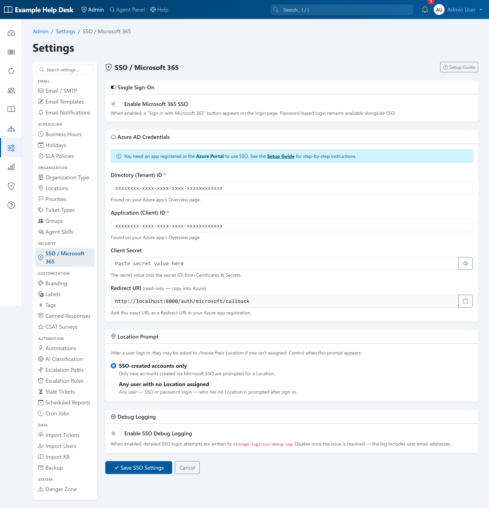
*SSO — toggle, Azure credentials (tenant + client ID + secret), read-only Redirect URI to paste into Azure, location-prompt behaviour, and debug logging.*

When enabled, a **Sign in with Microsoft** button appears on the login page. Password login remains available alongside SSO — SSO doesn't replace passwords.

Setup is similar to the Graph inbound-email flow but uses OAuth 2.0 authorization code (delegated) rather than client credentials.

1. **Azure Portal → Microsoft Entra ID → App registrations → + New registration.**
   - Name: e.g. "OpenHelpDesk SSO"
   - Supported account types: **Single tenant**.
   - Redirect URI: pick **Web** and paste the value from the OpenHelpDesk page (shown read-only — copy the exact URL).
2. **Authentication tab** — make sure the Web platform is configured with the redirect URI; under "Implicit grant and hybrid flows", leave both unchecked (we use auth code).
3. **API permissions** — Microsoft Graph → **Delegated** → add `openid`, `profile`, `email`, `User.Read`. Grant admin consent if your tenant requires it.
4. **Certificates & secrets → + New client secret.** Copy the **Value** immediately.
5. Paste **Tenant ID**, **Client ID**, **Client Secret** into the OpenHelpDesk SSO form. Save.
6. Tick **Enable Microsoft 365 SSO**. The Sign in with Microsoft button now appears on `/login`.

#### Location prompt behaviour

After SSO sign-in, OpenHelpDesk can prompt a user to pick their location if one isn't assigned. Two options:

- **SSO-created accounts only** *(default)* — only new accounts created via Microsoft SSO are prompted. Existing users with no location are left alone.
- **Any user with no location assigned** — both SSO and password users get prompted. Use this if you want to enforce a location on every account regardless of how they sign in.

#### Debug logging

If SSO sign-in fails for a user and the error message is unhelpful, flip on **SSO Debug Logging** on the same page. Every subsequent attempt writes detailed entries to `storage/logs/sso-debug.log`. The log includes user email addresses, so **turn debug logging off** once the issue is resolved.

There's a live tail of the log directly on the SSO settings page when debug is on, plus a **Clear Log** button. The most common failure is a mismatched redirect URI — the URL OpenHelpDesk redirects to must match the Azure redirect URI exactly (including https vs http and trailing slash).

---

## 24. Portal & floor mode

### The end-user portal

`/portal` is the end-user landing page. Share this URL with everyone who'll be submitting tickets — staff intranet, a printed sign in the lobby, an autoresponder from your old ticket system, whatever. Portal users see only their own tickets (or their location's tickets if they have **Location Ticket Visibility**), can browse the KB, can submit new tickets, and can self-escalate tickets they've submitted.


*The end-user portal — submit a ticket, track yours, browse the KB.*

The portal features a six-step **onboarding tour** (Driver.js) on first login that points out the New Ticket button, the KB search, and the ticket list. Users can replay it any time from their avatar menu.

When a portal user creates a ticket, the form supports:

- KB article suggestions as they type the subject (inline, no submit needed).
- File attachments (configurable size limit, default 20 MB; allowed MIME types in `.env`).
- Optional priority / type / location / assignee.
- The browser and OS are auto-captured for technical troubleshooting.

### Floor mode (iPad / roaming staff)

`/floor` is a touch-optimised, card-style ticket queue designed for an iPad held by a roaming librarian / desk officer / lead tech. Big touch targets, swipe gestures for accept / decline / reassign, a streamlined ticket detail page focused on **reply** and **status change**.


*Floor mode — touch-friendly card queue.*


*Floor mode ticket detail — focused, fast, optimised for iPad.*

Floor mode uses the same auth as the agent panel; whichever agent is logged in sees their own queue. Toggle from the avatar menu → **Floor mode** or just navigate to `/floor` directly. Bookmark it as a home-screen icon on iPad for a one-tap launch.

---

## 25. REST API & mobile tokens

OpenHelpDesk ships a Bearer-token REST API that mirrors most of the UI. Use it for mobile apps, integrations, scripts, dashboards, anything.

### Tokens

Tokens are generated per-user at **My Profile → API Tokens** (or **Admin → Users → Edit → Tokens**).

- Token is shown **once** — copy it immediately.
- Stored as a SHA-256 hash at rest. Compromising the database can't reveal active tokens.
- Configurable expiry (or no expiry).
- Revoke any time.

### Endpoints

Full OpenAPI 3.0.3 spec at the repo root: [`openapi.json`](openapi.json). Highlights:

| Path | Verb | Purpose |
|---|---|---|
| `/api/v1/tickets` | GET | List tickets (filterable). |
| `/api/v1/tickets` | POST | Create a ticket. |
| `/api/v1/tickets/{id}` | GET | Read one. |
| `/api/v1/tickets/{id}` | PATCH | Update. |
| `/api/v1/tickets/{id}/comments` | POST | Add a comment (public or internal). |
| `/api/v1/users` | GET | List users. |
| `/api/v1/groups` | GET | List groups. |
| `/api/v1/kb/articles` | GET | List KB articles. |
| `/api/v1/notifications` | GET | Current user's notifications. |
| `/health` | GET | JSON health check (no auth). Use from your monitoring system. |

Auth header: `Authorization: Bearer <token>`. CSRF is **not** enforced on Bearer-authenticated requests (a Bearer token *is* the CSRF protection — it's not in cookies).

Rate limit: requests per token are tracked in the `api_request_log` table and a `429 Too Many Requests` is returned once the threshold is exceeded. Default thresholds are sensible for normal use; tune them in code if you have a heavy integration.

---

## 26. Backups

**Admin → Settings → Backup.**

Click **Create Backup** and the system produces a `.zip` in `storage/backups/` containing:

- A full `mysqldump` of the database (or a fallback PHP-side dump if `mysqldump` isn't in the PATH).
- Every uploaded file: `storage/attachments/`, `public/uploads/branding/`, `public/uploads/avatars/`.
- A metadata JSON file with the OpenHelpDesk version, timestamp, table count, attachment count, and total size.

Each backup is a self-contained snapshot. To restore on a new server:

1. Install OpenHelpDesk to the same major.minor version (e.g. 2.42.x restores into a 2.42.x install).
2. Drop the existing database; recreate it empty.
3. Unzip the backup into the project root, replacing `storage/` and `public/uploads/`.
4. Load the SQL dump into the empty database: `mysql localdesk < storage/backups/extracted/openhelpdesk-YYYY-MM-DD.sql`.

You can also download backups directly from the page — the list at the bottom shows every backup with its size and a download link. Backups are stored outside the webroot (`storage/` not `public/`) so they're never accidentally served over HTTP.

### Backup retention

There's no automatic retention policy — backups accumulate. Either:

- Periodically delete old ones from the UI.
- Or add a cron line like `0 3 * * 0 find /var/www/openhelpdesk/storage/backups -name 'openhelpdesk-*.zip' -mtime +30 -delete` to clean up backups older than 30 days every Sunday at 3am.

### Offsite copies

For production, copy the `.zip`s offsite. A cron line like:

```cron
30 3 * * * rsync -az /var/www/openhelpdesk/storage/backups/ backups@offsite-host:/var/backups/openhelpdesk/
```

…or shipping them to S3 / Backblaze / wherever you keep your other backups, is the right thing.

---

## 27. Importing existing data

If you're migrating from another helpdesk (Spiceworks, OSTicket, Zendesk, Freshdesk, SharePoint lists, a spreadsheet, etc.), three CSV importers cover most cases.

### 26.1 Import users

**Admin → Settings → Import Users.**

Upload a CSV, then on the next page **map columns** to OpenHelpDesk fields (Email, First Name, Last Name, Role, Location, Active). The dry-run preview shows the first 20 rows with per-row validation: green = will be created, blue = will be updated (existing email match), red = errors. Submit when the preview looks right.

A sample CSV is downloadable from the same page so you know exactly what headers to use.

### 26.2 Import tickets

**Admin → Settings → Import Tickets.**

Same workflow as users: upload, map columns, dry-run, commit. Supports requester email, subject, body, type, priority, status, location, assigned agent, group, tags (comma-separated), creation timestamp.

> **Heads up:** importing pre-resolved tickets with their original creation timestamp can skew your historical SLA metrics. If you only care about going-forward SLA, set the import to default status = Closed for archived tickets, and let SLA reporting start from your go-live date.

### 26.3 Import KB articles

**Admin → Settings → Import KB.**

Upload a CSV with category / folder / title / body / tags / published columns. Bodies can be HTML or Markdown — the importer detects which based on tag presence. Useful for migrating from a wiki or an existing FAQ spreadsheet.

---

## 28. Maintenance & troubleshooting

### Audit log

Every significant admin action — user creation, role change, settings update, SLA policy edit, automation rule edit, manager skill assignment, confidential ticket access — is recorded in `audit_log` and surfaced at **Admin → Audit Log**.

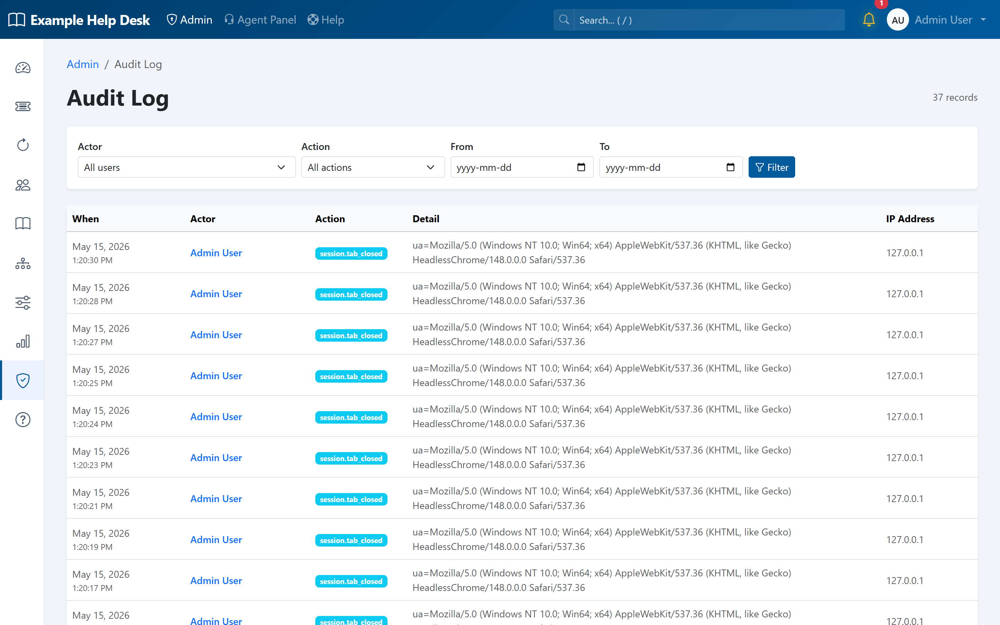
*The audit log — actor, action, target, timestamp, and IP address per row. Filter by actor or action across the top.*

### Logs

All runtime logs live in `storage/logs/`. The useful ones:

| File | What's in it |
|---|---|
| `smtp.log` | Every outgoing-mail attempt when SMTP Debug Logging is on. |
| `graph-mail.log` | Output of `scripts/process-replies.php`. |
| `escalations.log` | Output of `scripts/process-escalations.php`. |
| `recurring-tickets.log` | Output of `scripts/process-recurring-tickets.php`. |
| `scheduled-reports.log` | Output of `scripts/process-scheduled-reports.php`. |
| `stale-tickets.log` | Output of `scripts/process-stale-tickets.php`. |
| `sla-cron.log` | Output of `public/sla-cron.php`. |
| `sso-debug.log` | When SSO Debug is on. |
| `secret-reminders.log` | Output of `scripts/process-secret-reminders.php`. |
| `php-error.log` | PHP errors. Web server's `error_log` directive should also point here. |

`tail -f storage/logs/*.log` is your friend during initial setup.

### The cron status dashboard

**Admin → Settings → Cron Jobs** is the first place to look when something automated stops working. It shows, per job, when its log was last touched and whether that falls within the expected window. Stale (amber) almost always means cron is dead or has a typo; Not configured (grey) means the job has never run, which usually means the crontab line was never added.

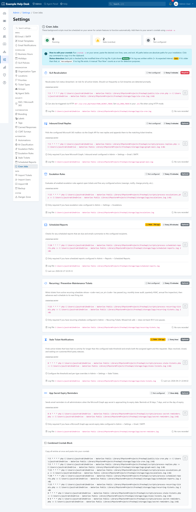
*Cron Jobs dashboard — three summary tiles at the top (Running / Stale / Not configured), then a card per job with the absolute crontab line, the log path, and a copy-to-clipboard button. The Combined Crontab Block at the bottom is the one-shot paste for `crontab -e`.*

### Admin password rescue

If you lock yourself out (no admin can log in), `scripts/admin/rescue.php` can reset a password or change a user's role from the CLI:

```bash
# Reset password for an existing admin
php scripts/admin/rescue.php reset admin@example.com 'New$ecret123'

# Promote an existing user to admin
php scripts/admin/rescue.php promote user@example.com admin

# List all admins
php scripts/admin/rescue.php list-admins
```

The script connects via the same `.env` credentials the app uses; no separate DB password needed.

### Common gotchas

- **After every `git pull` on Linux** — re-`chown -R www-data:www-data /path/to/openhelpdesk` because pulling overwrites file ownership and the web server stops being able to write to `storage/`.
- **Email links go to localhost or the wrong domain** — `APP_URL` is wrong in `.env`. Edit it (don't try to override via OS env var — `loadEnv()` is authoritative).
- **SLA states never update** — the SLA cron isn't running. Check **Settings → Cron Jobs**.
- **"Migration timeout" on a first request after a deploy** — a long-running migration is in progress. Don't refresh; let it finish. Migrations are idempotent and apply on every request via `src/bootstrap.php`.
- **`storage/installed.lock` is missing after a hosting move** — re-create it: `touch storage/installed.lock`. Otherwise `/install/` re-arms and could overwrite your DB.
- **Inbound email pulls duplicates** — a `Message-ID` header collision (rare); check `storage/logs/graph-mail.log` for `Already processed` lines, and consider rotating the mailbox if you suspect another mail-processor is racing OpenHelpDesk.

---

## 29. Danger zone — full reset

**Admin → Settings → Danger Zone.**

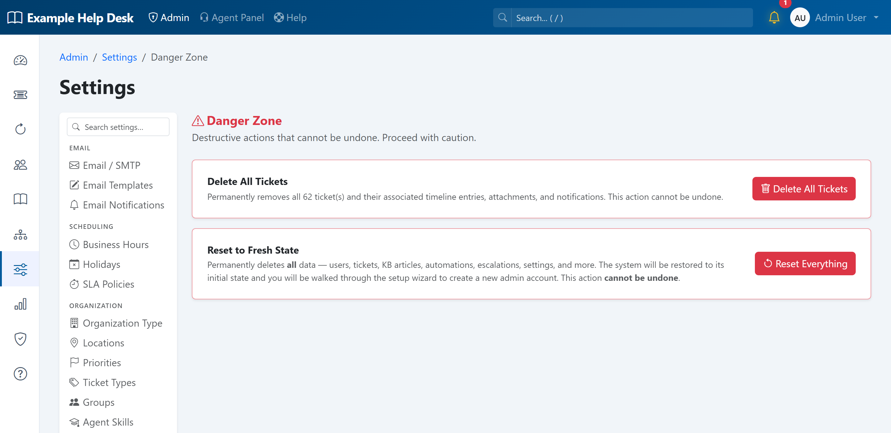
*The Danger Zone — two destructive actions, each behind a confirmation modal that requires typing the action verb to enable the submit button.*

Two destructive actions live here. Both are irreversible.

### Delete all tickets

Permanently removes every ticket and its timeline entries, attachments, and notifications. Users, KB articles, settings, automations, escalations, SLA policies stay intact. A `prompt('Type DELETE to confirm…')` browser dialog catches accidental clicks.

Use this when you've been evaluating with real tickets and want to wipe the queue clean before going live, without re-doing all your configuration.

### Reset to fresh state

Permanently deletes **all** data — users, tickets, KB articles, automations, escalations, SLA policies, locations, groups, settings, audit log. The system is restored to its initial state. You're logged out immediately and walked through the setup wizard to create a new admin account and restore your helpdesk name.

To confirm, type `RESET` in the modal box. There's no second chance.

Use this if you ran an evaluation that turned into a full test environment, decided to restart properly, and want a clean slate without dropping the database manually.

---

## Appendix A — Cron job reference

The authoritative version of this list is at **Admin → Settings → Cron Jobs** because it interpolates the absolute path for your install. Copy from there.

| Job | Frequency | Required? | Script |
|---|---|---|---|
| SLA Recalculation | every 5 min | **Yes** | `public/sla-cron.php` |
| Inbound Email Replies | every 5 min | If Graph configured | `scripts/process-replies.php` |
| Escalation Rules | every 15 min | If rules exist | `scripts/process-escalations.php` |
| Recurring Tickets | every 15 min | If recurring schedules exist | `scripts/process-recurring-tickets.php` |
| Scheduled Reports | every 30 min | If schedules exist | `scripts/process-scheduled-reports.php` |
| Stale Ticket Notifications | hourly | Optional | `scripts/process-stale-tickets.php` |
| App Secret Expiry Reminders | daily at 08:00 | If Graph configured | `scripts/process-secret-reminders.php` |

---

## Appendix B — Key URL endpoints

| Path | Description |
|---|---|
| `/install/` | Web installer wizard (locked after first run). Delete or restrict access. |
| `/` | Home (redirects by role). |
| `/login` | Sign in. |
| `/auth/microsoft` | Microsoft 365 SSO entry point. |
| `/profile` | User profile (name, password, theme, 2FA). |
| `/kb` | **Public** knowledge base (no login required). |
| `/portal` | End-user portal. |
| `/portal/tickets` | User's tickets. |
| `/portal/tickets/create` | Submit a new ticket. |
| `/portal/kb` | Authenticated portal KB. |
| `/agent` | Agent dashboard. |
| `/agent/tickets` | Agent ticket queue. |
| `/agent/canned-responses` | Agent canned responses. |
| `/floor` | Floor mode (iPad). |
| `/manager` | Group-manager surface (visible if you manage at least one group). |
| `/admin` | Admin dashboard. |
| `/admin/tickets` | All tickets. |
| `/admin/ticket-templates` | Ticket template management. |
| `/admin/users` | User management. |
| `/admin/users/online` | Live online presence. |
| `/admin/groups` | Group management. |
| `/admin/types` | Ticket type management. |
| `/admin/priorities` | Priority management. |
| `/admin/skills` | Agent skills catalogue. |
| `/admin/kb/articles` | KB management (articles, folders, categories). |
| `/admin/reports` | Reports & Analytics overview. |
| `/admin/audit-log` | Admin audit log. |
| `/admin/workflows/ticket-fields` | Custom form-field builder. |
| `/admin/settings` | All settings (start here). |
| `/admin/settings/organization` | Organization type (sector / industry). |
| `/admin/settings/ai` | AI Classification. |
| `/admin/settings/ai/debug` | Raw HTTP debug for AI providers. |
| `/admin/settings/branding` | Branding (logo, colours). |
| `/admin/settings/business-hours` | Business hours & timezone. |
| `/admin/settings/holidays` | Holidays & closed days. |
| `/admin/settings/sla-policies` | SLA policies. |
| `/admin/settings/csat` | CSAT surveys. |
| `/admin/settings/email-templates` | Outbound email templates. |
| `/admin/settings/escalations` | Time-based escalation rules. |
| `/admin/settings/escalation-paths` | Manual escalation paths. |
| `/admin/settings/stale-tickets` | Stale-ticket thresholds. |
| `/admin/settings/cron-jobs` | Cron job dashboard. |
| `/admin/settings/labels` | Label vocabulary customisation. |
| `/admin/settings/sso` | Microsoft 365 SSO. |
| `/admin/settings/danger-zone` | Delete all tickets / full reset. |
| `/admin/docs` | Built-in admin documentation (per-feature reference). |
| `/notifications` | Notification inbox. |
| `/api/v1/tickets` | REST API — ticket list / create (Bearer token). |
| `/health` | Health check (JSON). |
| `/sla-cron.php` | SLA recalc (CLI or HTTP with token). |

---

## Appendix C — Environment variables

`.env` is generated by the installer and read by `src/bootstrap.php`. Edit the file directly to change anything; environment variables exported in the shell are **overwritten** by `.env` values on every request.

| Variable | Description | Default |
|---|---|---|
| `APP_NAME` | Application display name (used as fallback before Branding is set). | `OpenHelpDesk` |
| `APP_URL` | Base URL for email links. Critical — set this correctly. | `http://localhost:8000` |
| `APP_DEBUG` | Show detailed errors. **Off in production.** | `true` |
| `APP_TIMEZONE` | PHP timezone for SLA calculations and timestamps. | `UTC` |
| `DB_HOST` | MySQL host. | `127.0.0.1` |
| `DB_PORT` | MySQL port. | `3306` |
| `DB_NAME` | Database name. | `localdesk` |
| `DB_USER` | Database user. | `root` |
| `DB_PASS` | Database password. | *(empty)* |
| `UPLOAD_MAX_SIZE` | Max attachment size in bytes. | `20971520` (20 MB) |
| `UPLOAD_ALLOWED_TYPES` | Comma-separated MIME whitelist for attachments. | PDF, JPEG, PNG, GIF, WEBP, DOC, DOCX, XLS, XLSX, plain text, ZIP |
| `SLA_CRON_TOKEN` | Secret token for HTTP-triggered SLA recalc. | *(empty — HTTP trigger disabled)* |

SMTP, branding colours, AI keys, SSO secrets, Graph credentials, and all other operational settings live in the `settings` database table — configurable through the admin UI, not `.env`. Putting them in the DB means a config change doesn't require an admin to SSH in.

---

## Appendix D — Further reading

The admin UI ships with its own per-feature documentation that goes deeper than this guide for each area. Find it at **Admin → Docs** (`/admin/docs`):

| Page | What's covered |
|---|---|
| `/admin/docs/getting-started` | Short version of this guide as cards on a single page. |
| `/admin/docs/users` | Roles, group managers, online presence, confidential groups in depth. |
| `/admin/docs/tickets` | Full ticket lifecycle, merge / split, watching, bulk actions. |
| `/admin/docs/sla` | SLA mechanics, pause/resume, re-initialisation. |
| `/admin/docs/automations` | Automations, group auto-assign, escalation rules, manual paths, stale tickets — all in one page. |
| `/admin/docs/ai` | AI provider setup, No Wrong Door, debugging, cost analysis. |
| `/admin/docs/email` | Inbound email backend deep-dive (Graph + IMAP). |
| `/admin/docs/sso` | Microsoft 365 SSO configuration. |
| `/admin/docs/portal` | Portal experience, escalation badges, KB suggestions. |
| `/admin/docs/kb` | Knowledge base structure, version history, public KB. |
| `/admin/docs/branding` | Branding details, timeline colours, label customisation. |
| `/admin/docs/import` | CSV import workflows. |
| `/admin/docs/flows` | Assignment flow diagrams. |

Outside the app:

- [`README.md`](README.md) — feature list, install summary, tech stack, default accounts.
- [`DOCS.md`](DOCS.md) — end-user / agent reference docs (portal, agent panel).
- [`CHANGELOG.md`](CHANGELOG.md) — version history.
- [`openapi.json`](openapi.json) — full REST API spec.
- [`TICKET_ASSIGNMENT_FLOWS.md`](TICKET_ASSIGNMENT_FLOWS.md) — diagrams of every auto-assignment strategy.

---

*Written for OpenHelpDesk v2.42.x. Maintained by the same person who wrote the code. If you find a step that's wrong, file an issue or send a PR — fixes that come back as PRs are the highest-value contribution you can make to this project.*
