# OpenHelpDesk

**OpenHelpDesk** is a self-hosted IT helpdesk and ticketing system built for libraries and small IT teams who want a capable support platform without SaaS fees or vendor lock-in. It runs on a plain LAMP stack — pure PHP 8 with a lightweight custom router, PDO, MySQL, and Bootstrap 5 — so it installs anywhere from XAMPP on Windows to a standard Apache box, via either a six-step web installer or a one-command seed script. Despite the modest footprint, it covers the full ticket lifecycle: assignment, prioritization, SLA tracking with business-hours and per-location timezone awareness, internal notes, attachments, tags, merging and splitting, bulk actions, custom form fields, and a drag-and-drop form builder.

Beyond core ticketing, OpenHelpDesk includes a three-tier knowledge base with a public help center and version history, twelve built-in reports plus a custom report builder and scheduled emailed reports, CSAT surveys, a rule-based automation and escalation engine, and full inbound email integration over IMAP or the Microsoft Graph API (including email-to-ticket and hashtag commands). It ships with Microsoft 365 SSO, optional TOTP two-factor auth, role-based access for admins/power users/agents/users, an end-user portal, an iPad-friendly "floor mode" for roaming staff, customizable branding and email templates, one-click backups, and a Bearer-token REST API with an OpenAPI spec. Security is built in throughout — CSRF protection, prepared statements, bcrypt hashing, output escaping, upload validation, and per-route role checks.

OpenHelpDesk also has optional AI-assisted triage, powered by your choice of Anthropic Claude or OpenAI (just paste an API key — no extra services to run). On arrival, a large language model reads each new ticket and suggests the agent skills it needs, scores its own confidence, and gauges sentiment; from there it can auto-route the ticket to the best-matching agent, hand an ambiguous "No Wrong Door" request off to the right team, bump priority when a requester sounds angry or urgent, and flag likely duplicate tickets before they're filed. The AI layer is built to fail safe — confidential ticket types are never sent to a provider, every call has a hard timeout with graceful fallback to manual routing, hallucinated skill IDs are stripped, and every verdict is audit-logged with provider, model, latency, and token counts. Released under the MIT License.

## Screenshots

| | |
|---|---|
| **Admin dashboard** | **All tickets** |
| 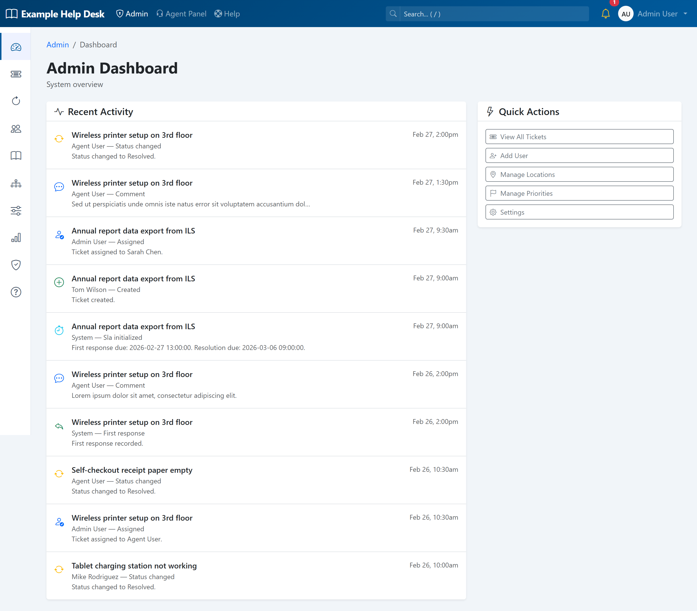 | 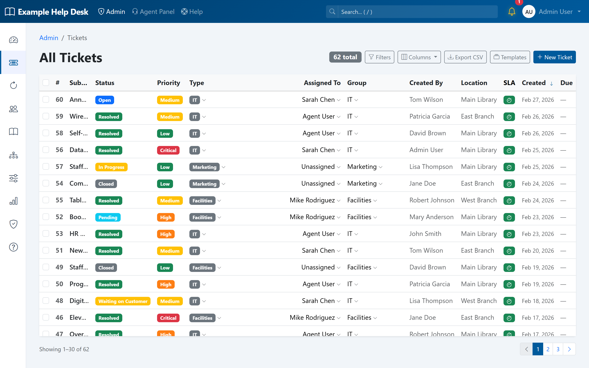 |
| **Ticket detail** — timeline, SLA, custom fields | **Reports & analytics** |
| 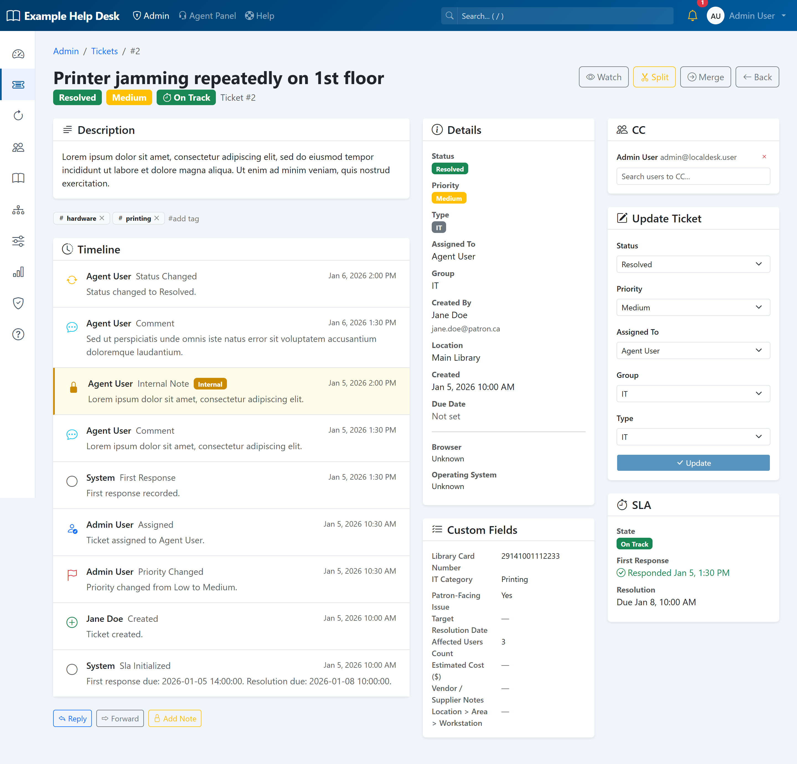 | 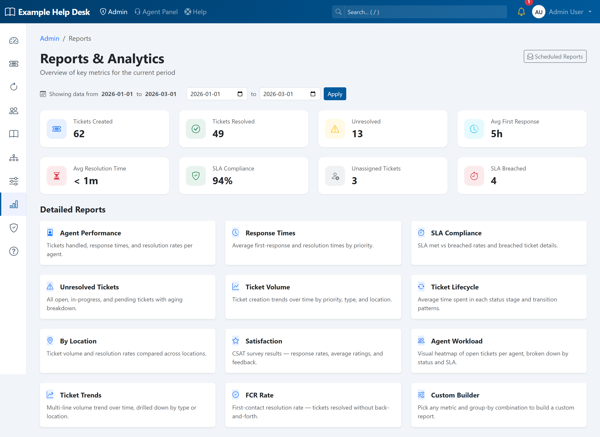 |
| **Drag-and-drop form builder** | **Knowledge base** |
| 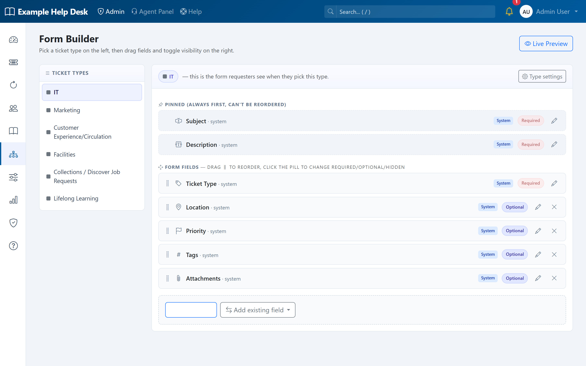 | 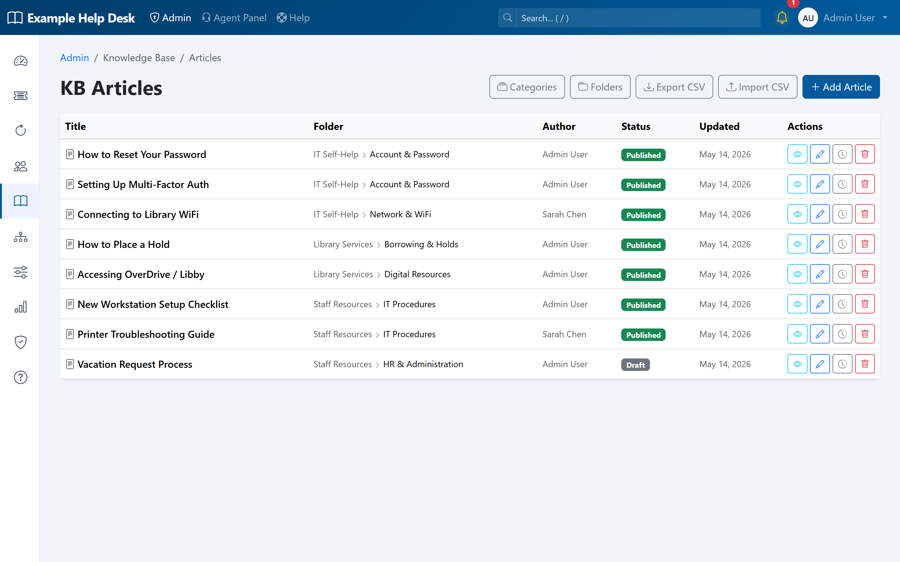 |
| **End-user portal** | **Sign in** |
| 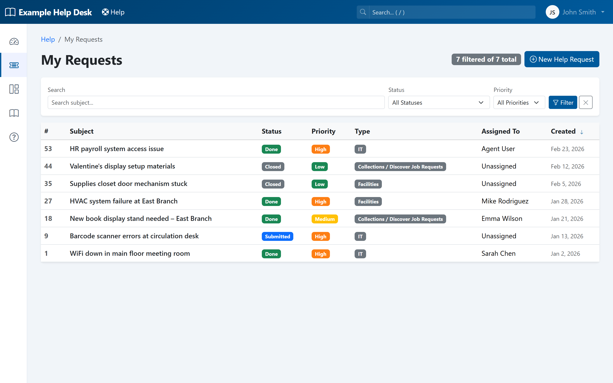 | 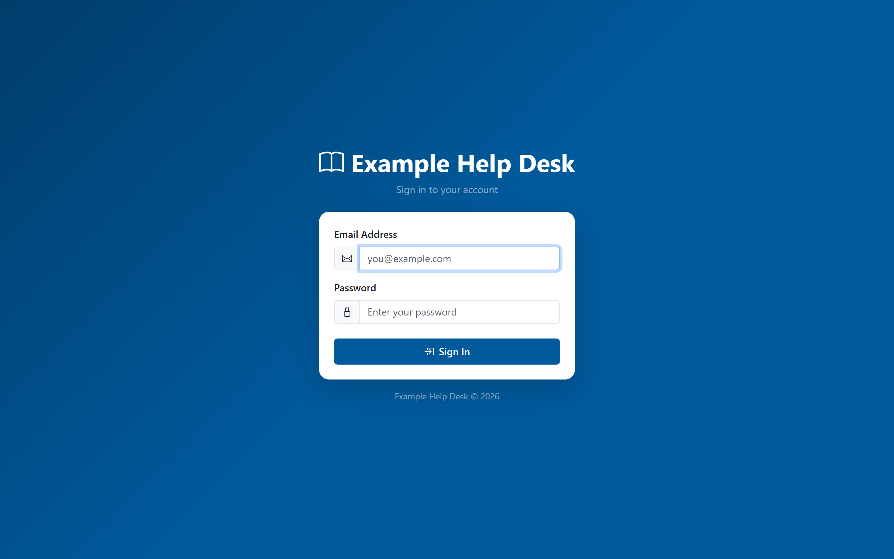 |
| **Public Help Center** — branded, searchable | **Knowledge base article** — with helpfulness voting |
| 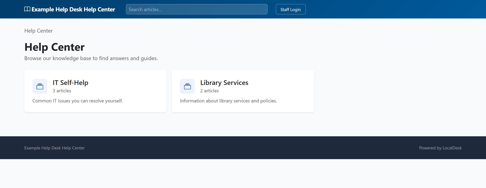 | 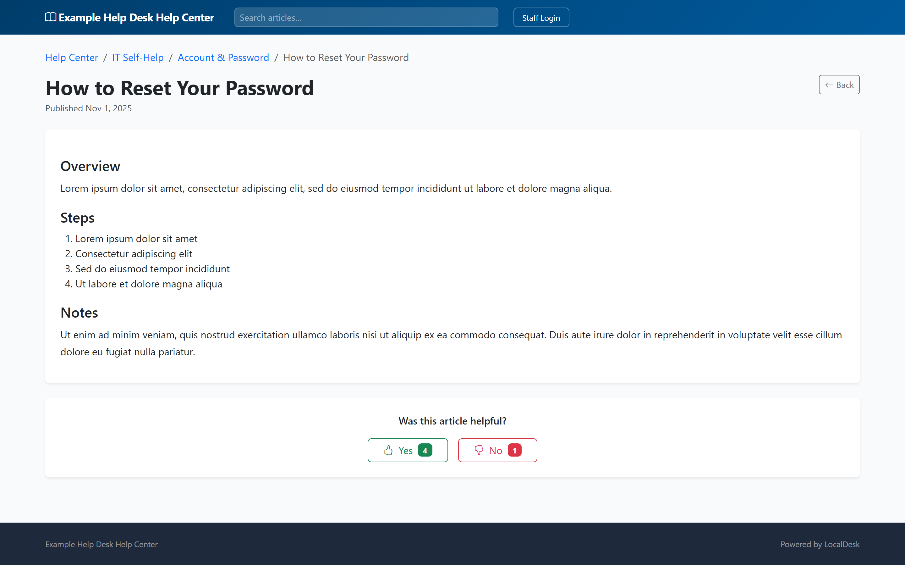 |
| **Rich-text editing everywhere** — KB article editor | **Email templates** — rich-text with dynamic tokens |
| 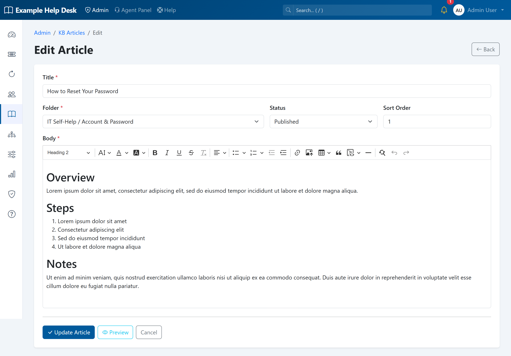 | 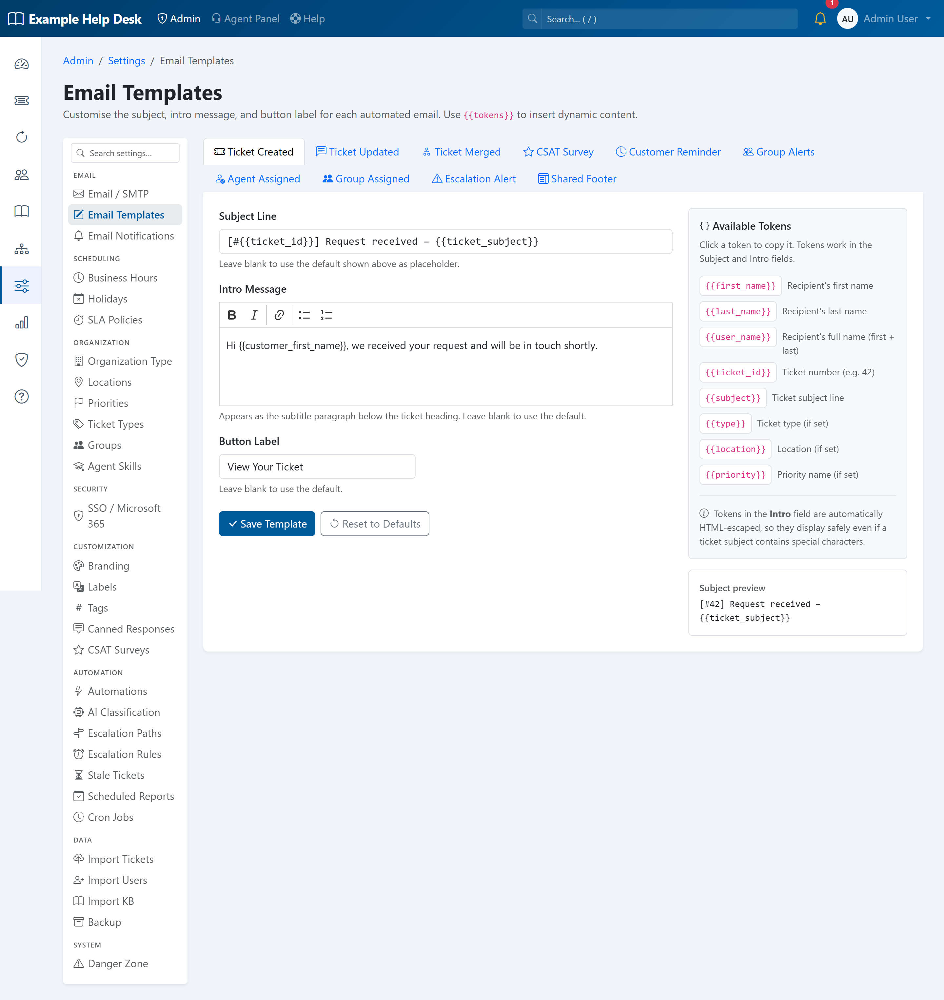 |
| **Fully configurable branding** — logo, colors, live preview | **iPad "floor mode"** — touch-friendly card queue for roaming staff |
| 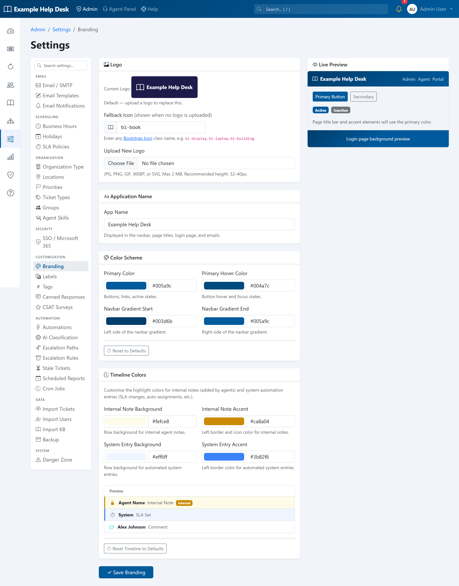 | 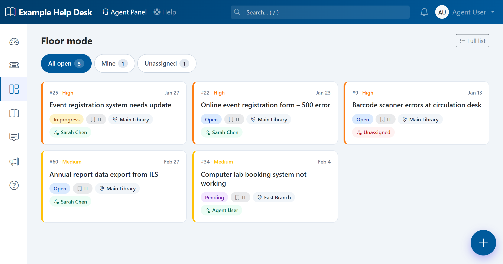 |
| **Floor mode** — streamlined ticket detail with quick actions | |
| 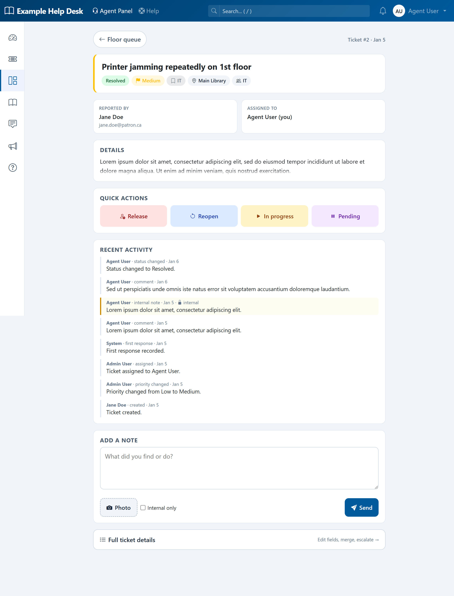 | |

*Screenshots show the bundled demo data (`php database/seed_test_data.php`).*

## Features

### Ticket Management
- Create, assign, prioritize, and track tickets through their full lifecycle (open, in progress, pending, waiting on customer, waiting on third party, resolved, closed)
- File attachments on tickets and comments (PDF, JPEG, PNG, and more; configurable size limit)
- Tags, location tagging, due dates, and browser/OS auto-detection on creation
- Internal notes visible only to agents and admins; public comments visible to the submitter
- CC additional users on a ticket to keep them in the notification loop
- **Ticket Merge** — combine duplicate tickets; choose which is primary; timeline entries, tags, and CC users are copied; source ticket is closed with a link to the primary
- **Ticket Splitting** — split a single ticket into two from the ticket detail view (admin and agent panels)
- **Ticket Watching** — agents and admins can watch tickets to receive all update notifications
- **Staff Ticket Creation** — admins and agents create tickets on behalf of users with full field control (status, assignment, group, due date, tags)
- **Bulk Actions** — select multiple tickets to assign, close, merge, or delete (admin only) in one operation
- **Ticket Templates** — reusable templates that pre-fill subject, body, type, and priority; shared templates appear as starting points on the portal create form
- **Custom Form Fields** — drag-and-drop Ticket Forms builder for adding custom fields to tickets (text, dropdown, checkbox, multi-select); fields shown in a dedicated sidebar column on the ticket detail view
- **Concurrent Viewer Warning** — presence detection alerts agents when another user is already viewing the same ticket
- **Auto-Assign on First Reply** — ticket automatically assigned to the agent or admin who posts the first public reply if previously unassigned
- **Reply / Forward / Note Panel** — tabbed panel on the ticket detail view for public replies, forwarding tickets to external addresses, and internal notes

### Filtering & Views
- **Slide-Out Filter Panel** — filters accessible via a collapsible side panel with state preserved across navigation
- **Saved & Default Filters** — save named filter presets, set a personal default view, and share filters with the team
- **Multi-Select Filters** — filter by multiple statuses, priorities, types, groups, and agents simultaneously on the ticket list
- **Watched Tickets Filter** — show only tickets you are watching
- **Per-Page Selector** — choose how many tickets appear per page (25 / 50 / 100)
- **Column Selector** — toggle which columns appear in the ticket list per user; also available on the agent dashboard Recent Tickets widget
- **Inline Ticket List Actions** — hover the Agent, Type, or Group column on any row to reveal a chevron dropdown for reassigning, changing type, or changing group without opening the ticket; agent dropdown filtered to group members when a group is set
- Filters persist when navigating from the ticket list to a ticket and back
- **Search by Ticket ID** — enter a ticket number in the global search box to jump directly to that ticket

### SLA Tracking
- Business-hours-aware service level agreements per priority level
- Per-location timezone support for multi-branch SLA calculations
- Tracks first response and resolution targets with automatic state transitions (on track, warning at 80%, breached)
- Timers pause when tickets enter pending/waiting status and resume on reactivation
- Recalculation on priority changes; cron script for periodic SLA state updates; admin recalculate button
- **Holidays / Closed Days** — configure public holidays and custom closed days; per-holiday option to exclude from SLA calculations

### Reports & Analytics
Twelve built-in report types accessible from the Reports Overview:
- **Agent Performance** — tickets handled, response times, and resolution rates per agent
- **Response Times** — average first-response and resolution times by priority
- **SLA Compliance** — SLA met vs breached rates and breached ticket details
- **Unresolved Tickets** — all open, in-progress, and pending tickets with aging breakdown
- **Ticket Volume** — ticket creation trends over time by priority, type, and location
- **Ticket Lifecycle** — average time spent in each status stage and transition patterns
- **By Location** — ticket volume and resolution rates compared across locations
- **Satisfaction (CSAT)** — customer satisfaction survey results: response rates, average ratings, and feedback
- **Agent Workload** — heatmap of open tickets per agent broken down by status and SLA
- **Ticket Trends** — multi-line volume trend drilled down by type or location
- **FCR Rate** — first-contact resolution rate for tickets resolved without back-and-forth
- **Custom Builder** — pick any metric and group-by combination to build a custom report
- **Scheduled Reports** — configure reports to run automatically and email results on a schedule; "Schedule" button on each report page for quick access

### CSAT Surveys
- Satisfaction surveys sent automatically after ticket resolution
- Configurable survey settings under Admin → Settings → CSAT
- Ratings and comments displayed in the Satisfaction report

### Knowledge Base
- Three-tier hierarchy (categories, folders, articles) with Markdown rendering
- Draft and published article statuses; full-text search from the portal
- KB article suggestions when creating a ticket (subject autocomplete)
- **Article Feedback** — helpful/not helpful ratings from portal users
- **Version History** — every article save creates a revision; admins can view and restore prior versions
- **Public KB** — categories and articles can be marked public and browsed without logging in at `/kb`
- **KB Article Import** — bulk import articles via CSV from Admin → Settings → Import KB

### Automations & Escalations
- **Automations** — rule-based engine triggered on ticket create or update; nested AND/OR condition groups; conditions match on type, priority, status, location, group, or assigned agent; actions: assign, set priority/status/group, add tag
- **Escalation Rules** — time-based policies that automatically reassign, change priority, or update status when tickets remain unresolved past configurable thresholds; includes waiting-on-customer reminder email action
- Both automations and escalation actions are logged as internal timeline entries

### Email & Notifications
- **In-App Notifications** — @mention system in ticket comments; unread badge with 15-second polling; mark read individually or all at once
- **Email Notification Preferences** — per-user opt-in/out controls for ticket creation, ticket update, and @mention emails
- **Email Notifications Settings** — admin page to manage all outgoing notification hooks
- **Group Email Notifications** — optional email alert to all group members when a new ticket is assigned to their group
- **Email Reply Integration** — inbound email replies automatically added as ticket comments; supports both IMAP and Microsoft Graph API (OAuth2 / Exchange Online)
- **Email-to-Ticket** — inbound emails to a monitored Microsoft Graph mailbox are automatically converted to new tickets
- **Email Hashtag Commands** — agents and admins can control tickets via `#close`, `#resolve`, and other hashtag commands in email replies
- **Customizable Email Templates** — edit the subject, intro message (rich-text CKEditor 5 editor), and button label for outgoing emails; templates: ticket created, ticket updated, ticket merged, CSAT survey, customer reminder, group alerts; shared footer tab for the footer on all ticket emails
- **Canned Responses** — personal snippets with token substitution insertable from the reply panel
- **Microsoft Graph App Secret Expiry Reminders** — warning banner and email alerts when the Graph API client secret is nearing expiry

### User Profiles & Authentication
- **User Profile** — all users can update name, change password (with current-password verification), set light/dark theme, and manage 2FA from `/profile`
- **Two-Factor Authentication (TOTP)** — optional TOTP-based 2FA for admin and agent accounts; admins can reset 2FA from the user management page
- **Microsoft 365 SSO** — single sign-on via OAuth 2.0 / Microsoft Entra ID; "Sign in with Microsoft" button on the login page
- **Dark Mode / Light Mode** — per-user theme preference stored in the database and applied on every page load

### Groups
- Organise agents and admins into departmental groups
- Agents who belong to groups see only tickets assigned to those groups; admins see all tickets
- Group membership visible on the agent/admin edit page

### Portal
- Portal ticket list defaults to own open tickets; **My Location** toggle for multi-location users
- Portal users without a location assignment are prompted to choose one when creating a ticket
- Onboarding tour (Driver.js) covering key portal pages

### Admin Tools
- **Audit Log** — admin-accessible trail of all admin actions with timestamp and actor, at `/admin/audit-log`
- **Admin Documentation** — built-in docs at `/admin/docs` with search
- **Agent Help Documentation** — built-in help pages for agents at `/agent/help` (dashboard, ticket list & filters, working on tickets, canned responses); accessible from the Help link in the agent sidebar
- **Onboarding Tour** — six-step walkthrough on first admin login, replayable from the user dropdown
- **Admin Password Rescue Script** — CLI script to reset an admin password or change a user's role when locked out of the UI
- **Danger Zone Full Reset** — wipe all data and re-run the setup wizard from the Settings page

### Ticket Import & Export
- **Import Tickets** — bulk-import tickets from CSV with a flexible column-mapping step; dry-run preview before committing
- **Import Users** — bulk-import user accounts from CSV with column mapping, dry-run preview, and duplicate detection; sample CSV available for download
- **Export** — export the current filtered ticket list as CSV (UTF-8 BOM for Excel compatibility)

### Branding & Settings
- Customise application name, logo, primary colour, navbar gradient, timeline entry colours, and navbar fallback icon
- Live preview panel; reset to defaults button
- Configurable label for "Location" throughout the UI (e.g. substitute "Branch" or "Site")
- Email and SMTP configuration through the admin UI; SMTP debug logging to `storage/logs/smtp.log`
- Business hours and timezone configuration; per-location timezone overrides
- SLA policies per priority with recalculate button
- Priority, type, group, location, and holiday management

### Backup
- One-click backup from Admin → Settings → Backup
- Produces a `.zip` containing a full SQL dump plus uploaded files (attachments, branding assets, avatars)

### Mobile REST API
- Full REST API with Bearer token authentication for mobile and third-party integrations
- Endpoints covering tickets, comments, users, groups, KB articles, and notifications
- OpenAPI 3.0.3 specification at `openapi.json`
- API tokens stored as hashes at rest with configurable expiry and rotation

### Security
- CSRF token protection on all POST forms and session-authenticated JSON API endpoints
- Bcrypt password hashing (`PASSWORD_DEFAULT`)
- Prepared statements for all SQL queries (no raw interpolation)
- HTML output escaping via `e()` helper throughout all templates
- File upload validation (MIME type whitelist and size limit; attachments stored outside webroot)
- Role checks on every route (`Auth::requireRole()`)
- Installer locked after first run via `storage/installed.lock`
- API tokens hashed at rest; secure session cookie flag set automatically under HTTPS

---

## Tech Stack

| Layer | Technology |
|-------|-----------|
| Language | PHP 8.0+ (strict types) |
| Database | MySQL 5.7+ (InnoDB, utf8mb4) |
| Frontend | Bootstrap 5.3.3, Bootstrap Icons 1.11.3 (CDN) |
| Email | PHPMailer 6 |
| Markdown | League CommonMark 2 |
| Routing | Custom `Router.php` (no framework) |
| Auth | Session-based with bcrypt password hashing |

## Requirements

- PHP 8.0 or higher
- MySQL 5.7 or higher
- Composer
- PHP extensions: `pdo_mysql`, `mbstring`, `json`, `openssl`, `fileinfo`, `zip`

## Installation

### Option A — Web Installer (recommended)

1. Clone the repository and install dependencies:
   ```bash
   git clone <repo-url> localdesk
   cd localdesk
   composer install
   ```
2. Point your web server's document root at the `public/` directory.
3. Visit **`/install/`** in your browser and follow the six-step wizard:
   - **Requirements** — checks PHP extensions and directory permissions.
   - **Database** — enter credentials; optionally create the database automatically.
   - **Application** — set app name, URL, and timezone.
   - **Admin Account** — create the first administrator.
   - **Mail Server** — configure SMTP (skippable; can be set later in Settings).
   - **Review & Install** — confirm and run the installation.
4. After installation, delete or restrict access to the `/install/` directory.

### Option B — Manual Setup

```bash
# 1. Clone and install dependencies
git clone <repo-url> localdesk
cd localdesk
composer install

# 2. Configure environment
cp .env.example .env
# Edit .env with your database credentials and app URL

# 3. Seed the database (creates DB, applies schema, stamps migrations, inserts sample data)
php database/seed.php

# 4. Configure your web server (see platform instructions below)
```

Then visit your configured site URL and log in with one of the seed accounts below.

---

## Web Server Configuration

The `DocumentRoot` (or equivalent) must point to the **`public/`** subdirectory, not the project root. URL rewriting must be enabled so that all requests are routed through `public/index.php`.

### XAMPP (Windows)

1. Open `C:\xampp\apache\conf\extra\httpd-vhosts.conf` and add:

   ```apache
   <VirtualHost *:80>
       ServerName localdesk.test
       DocumentRoot "C:/xampp/htdocs/localdesk/public"

       <Directory "C:/xampp/htdocs/localdesk/public">
           AllowOverride All
           Require all granted
       </Directory>
   </VirtualHost>
   ```

2. Add `127.0.0.1 localdesk.test` to `C:\Windows\System32\drivers\etc\hosts`.
3. Restart Apache from the XAMPP Control Panel.
4. Make sure `mod_rewrite` is enabled — in `httpd.conf` the line `LoadModule rewrite_module modules/mod_rewrite.so` must be uncommented.
5. Set `APP_URL=http://localdesk.test` in your `.env` file.

### LAMP Stack (Ubuntu / Debian)

Enable `mod_rewrite` and create a virtual host:

```bash
sudo a2enmod rewrite
sudo systemctl restart apache2
```

```bash
sudo nano /etc/apache2/sites-available/localdesk.conf
```

```apache
<VirtualHost *:80>
    ServerName openhelpdesk.example.com
    DocumentRoot /var/www/localdesk/public

    <Directory /var/www/localdesk/public>
        AllowOverride All
        Require all granted
    </Directory>
</VirtualHost>
```

```bash
sudo a2ensite localdesk.conf
sudo systemctl reload apache2
```

Set `APP_URL=http://openhelpdesk.example.com` in your `.env` file.

### Windows IIS

1. Install the **URL Rewrite** module from the IIS website (required for routing).
2. Install **PHP** via the Web Platform Installer or manually, and register it with IIS as a FastCGI handler.
3. In **IIS Manager**, create a new site pointing its **Physical path** to the `public\` subdirectory of the project.
4. The `public\.htaccess` rules are not read by IIS. Create a `web.config` file inside `public\` with equivalent rewrite rules:

   ```xml
   <?xml version="1.0" encoding="UTF-8"?>
   <configuration>
     <system.webServer>
       <rewrite>
         <rules>
           <rule name="OpenHelpDesk Front Controller" stopProcessing="true">
             <match url="^(.*)$" />
             <conditions>
               <add input="{REQUEST_FILENAME}" matchType="IsFile" negate="true" />
               <add input="{REQUEST_FILENAME}" matchType="IsDirectory" negate="true" />
             </conditions>
             <action type="Rewrite" url="index.php" />
           </rule>
         </rules>
       </rewrite>
     </system.webServer>
   </configuration>
   ```

5. Ensure the IIS application pool identity has **read/write** access to the `storage\` directory.
6. Set `APP_URL` in your `.env` to match the IIS site binding URL.

## Default Accounts (seed only)

| Email | Password | Role |
|-------|----------|------|
| `admin@localdesk.user` | `Password123!` | Admin |
| `agent@localdesk.user` | `Password 123!` | Agent |
| `user@localdesk.user` | `Password123!` | User |

## Environment Variables

| Variable | Description | Default |
|----------|-------------|---------|
| `APP_NAME` | Application display name | `OpenHelpDesk` |
| `APP_URL` | Base URL for email links | `http://localhost:8000` |
| `APP_DEBUG` | Show detailed errors | `true` |
| `APP_TIMEZONE` | PHP timezone | `UTC` |
| `DB_HOST` | MySQL host | `127.0.0.1` |
| `DB_PORT` | MySQL port | `3306` |
| `DB_NAME` | Database name | `localdesk` |
| `DB_USER` | Database user | `root` |
| `DB_PASS` | Database password | *(empty)* |
| `UPLOAD_MAX_SIZE` | Max attachment size in bytes | `20971520` (20 MB) |
| `SLA_CRON_TOKEN` | Secret token for web-based SLA cron | *(empty)* |

SMTP settings are configured through the admin UI at **Settings → Email / SMTP**.

## Key Endpoints

| Path | Description |
|------|-------------|
| `/install/` | Web-based setup wizard (removed after install) |
| `/` | Home (redirects by role) |
| `/login` | Sign in |
| `/auth/microsoft` | Microsoft 365 SSO entry point |
| `/profile` | User profile (name, password, theme, 2FA) |
| `/kb` | Public knowledge base (no login required) |
| `/portal` | End-user portal |
| `/portal/tickets` | User's tickets |
| `/portal/tickets/create` | Submit a new ticket |
| `/portal/kb` | Knowledge base (authenticated portal view) |
| `/agent` | Agent dashboard |
| `/agent/tickets` | Agent ticket queue |
| `/agent/tickets/create` | Create a new ticket (agent) |
| `/agent/canned-responses` | Agent canned responses |
| `/admin` | Admin dashboard |
| `/admin/tickets` | All tickets |
| `/admin/tickets/create` | Create a new ticket (admin) |
| `/admin/ticket-templates` | Ticket template management |
| `/admin/users` | User management |
| `/admin/groups` | Group management |
| `/admin/kb/articles` | Knowledge base management (articles, folders, categories) |
| `/admin/reports` | Reports & Analytics overview |
| `/admin/audit-log` | Admin audit log |
| `/admin/workflows/ticket-fields` | Custom ticket form field builder |
| `/admin/settings` | Email, business hours, SLA, branding, automations, import, backup, CSAT, escalation rules, email templates, scheduled reports, holidays, notifications, SSO |
| `/admin/docs` | Built-in documentation |
| `/notifications` | Notification inbox |
| `/api/v1/tickets` | REST API — ticket list/create (Bearer token) |
| `/health` | Health check (JSON) |

## Role-Based Access

| Capability | Admin | Power User | Agent | User |
|---|:---:|:---:|:---:|:---:|
| Submit tickets (portal) | — | — | — | ✓ |
| Create tickets on behalf of users | ✓ | ✓ | ✓ | — |
| View & reply to all tickets | ✓ | ✓ | ✓ | — |
| View own tickets (portal) | — | — | — | ✓ |
| Internal notes | ✓ | ✓ | ✓ | — |
| Two-Factor Authentication (TOTP) | ✓ | ✓ | ✓ | — |
| User management | ✓ | — | — | — |
| Settings & branding | ✓ | — | — | — |
| KB management | ✓ | — | — | — |
| Reports & Analytics | ✓ | ✓ | — | — |
| Audit log | ✓ | — | — | — |
| Automations & escalation rules | ✓ | — | — | — |
| Backup | ✓ | — | — | — |

## Project Structure

```
localdesk/
├── config/
│   └── version.php             # APP_VERSION constant (Semantic Versioning)
├── database/
│   ├── migrations/             # Numbered migration files (auto-applied on startup)
│   ├── migrate.php             # Migration runner (invoked by src/bootstrap.php each request)
│   ├── schema.sql              # Full database schema snapshot (50 tables)
│   ├── seed.php                # Drop, recreate, and seed demo data (dev only)
│   └── seed_test_data.php      # Drop, recreate, and seed two months of test data (dev only)
├── public/
│   ├── index.php               # Front controller
│   ├── install/                # Web installer (delete after setup)
│   ├── .htaccess               # Apache rewrite rules
│   ├── css/style.css           # Custom styles
│   ├── sla-cron.php            # Standalone SLA recalculation script
│   └── uploads/                # Branding assets and user avatars
├── scripts/
│   ├── admin/rescue.php             # CLI admin password reset / role change script
│   ├── process-replies.php          # Inbound email processor (IMAP or Microsoft Graph API)
│   ├── process-escalations.php      # Time-based escalation rule runner
│   ├── process-recurring-tickets.php  # Recurring ticket generator
│   ├── process-scheduled-reports.php  # Scheduled report mailer
│   ├── process-stale-tickets.php    # Stale-ticket notifications
│   └── process-secret-reminders.php   # Microsoft Graph secret-expiry reminders
├── src/
│   ├── Auth.php                # Session-based authentication
│   ├── Database.php            # PDO singleton connection
│   ├── Router.php              # Lightweight request router
│   ├── Sla.php                 # SLA computation (business hours aware)
│   ├── bootstrap.php           # App initialisation (env, session, constants)
│   ├── helpers.php             # CSRF, flash, render, email, sidebar helpers
│   ├── routes.php              # Top-level routes (home, auth, profile, public KB)
│   └── routes/
│       ├── admin.php           # Admin routes (users, settings, KB, tickets, reports, audit log, …)
│       ├── agent.php           # Agent routes (tickets, comments, canned responses)
│       ├── api.php             # REST API routes (Bearer token authentication)
│       └── portal.php          # Portal routes (user tickets, KB, attachments)
├── storage/
│   ├── attachments/            # Ticket file attachments (outside webroot)
│   ├── backups/                # Backup zip files (outside webroot)
│   └── logs/                   # smtp.log and other runtime logs
├── templates/
│   ├── layouts/                # Base and app layouts
│   ├── pages/
│   │   ├── admin/
│   │   │   ├── docs/           # Built-in admin documentation pages
│   │   │   ├── reports/        # Report pages (overview + 12 individual reports)
│   │   │   ├── settings/       # Settings pages (email, SLA, branding, escalations, CSAT, …)
│   │   │   ├── tickets/        # Admin ticket list and detail views
│   │   │   └── …
│   │   ├── agent/              # Agent pages (dashboard, tickets, canned responses)
│   │   └── portal/             # Portal pages (dashboard, tickets, KB)
│   ├── partials/               # Reusable components (navbar, sidebar, onboarding tour, docs nav)
│   └── emails/                 # HTML email templates
├── tests/
│   ├── Feature/                # PHPUnit integration tests (authenticated HTTP)
│   └── Support/                # Test base class and database seeder
├── openapi.json                # OpenAPI 3.0.3 specification for the REST API
├── vendor/                     # Composer dependencies
├── composer.json
├── .env.example
└── README.md
```

## Cron Jobs

Several background scripts keep SLA states, escalations, recurring tickets, scheduled reports, and email processing up to date. Add all of them to your server's crontab (the post-install page also lists these):

```bash
*/5  * * * * php /path/to/localdesk/public/sla-cron.php
*/5  * * * * php /path/to/localdesk/scripts/process-replies.php
*/15 * * * * php /path/to/localdesk/scripts/process-escalations.php
*/15 * * * * php /path/to/localdesk/scripts/process-recurring-tickets.php
*/30 * * * * php /path/to/localdesk/scripts/process-scheduled-reports.php
0    * * * * php /path/to/localdesk/scripts/process-stale-tickets.php
0    8 * * * php /path/to/localdesk/scripts/process-secret-reminders.php
```

Full cron details are also shown in **Admin → Settings → Cron Jobs**.

The SLA recalculation can alternatively be triggered via HTTP with a secret token (set `SLA_CRON_TOKEN` in `.env`):

```
GET https://yoursite.com/sla-cron.php?token=YOUR_SLA_CRON_TOKEN
```

Admins can also manually recalculate SLA states from **Settings → SLA Policies → Recalculate All**.

## Inbound Email (Reply-to-Ticket)

Replies to ticket notification emails are automatically added as comments. Two backends are supported:

- **IMAP** — configure a mailbox in Settings → Email; run `scripts/process-replies.php` via cron
- **Microsoft Graph API** — OAuth2-based connection to Microsoft 365 / Exchange Online mailboxes; configure under Settings → Email → Graph API tab; run `scripts/process-replies.php` via cron or trigger from Settings → Run Now

Agents and admins can also control tickets via hashtag commands in email replies (e.g. `#close`, `#resolve`).

## License

Open source and free to the world under the [MIT License](LICENSE) — use it, modify it, ship it, no strings attached.

## Credits & Donations

OpenHelpDesk was vibe coded by Chris Jasztrab at the Waterloo Public Library.

If this software helped you out, please consider making a donation to the Waterloo Public Library: <https://www.wpl.ca/your-library/donate/>
