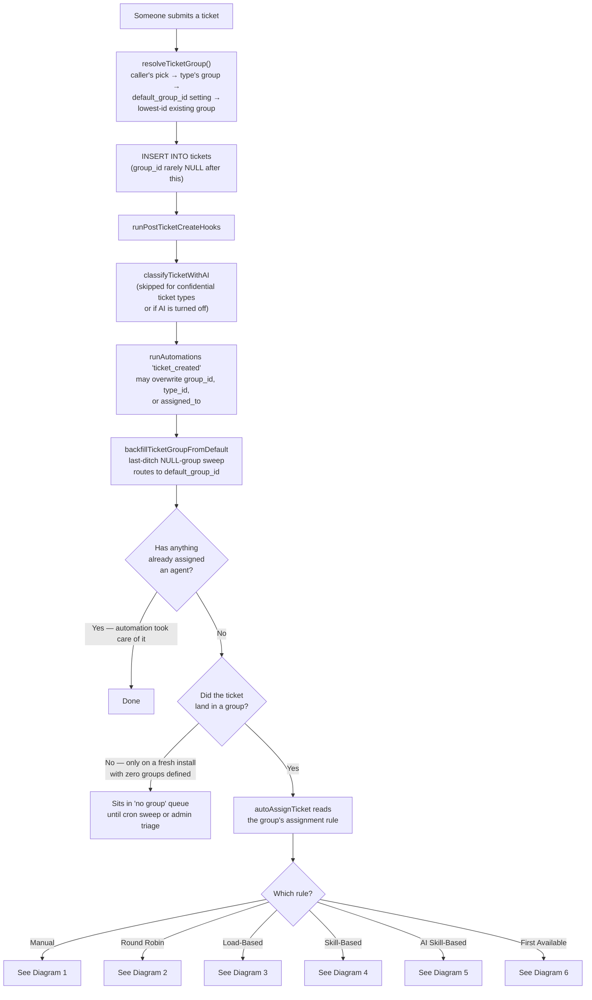
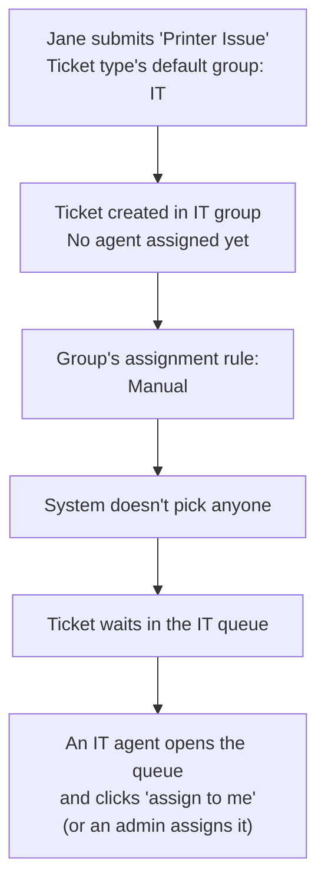
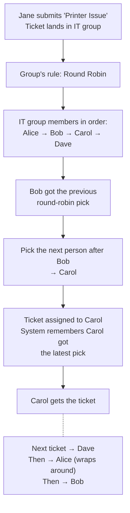
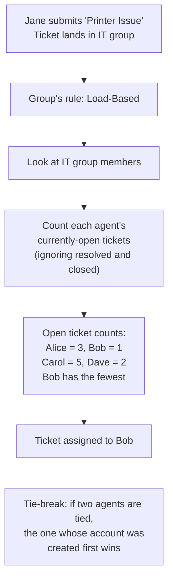
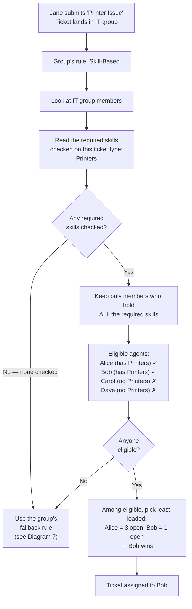
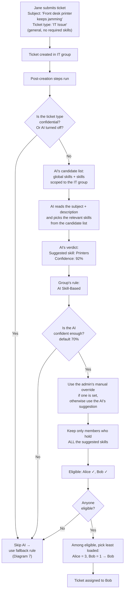
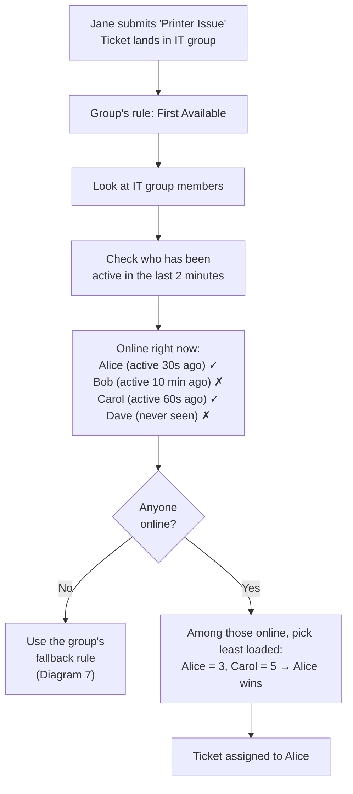
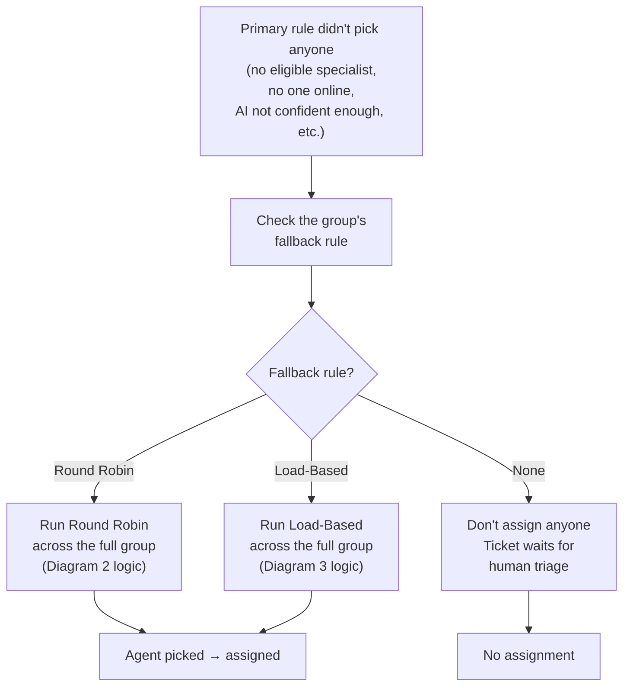
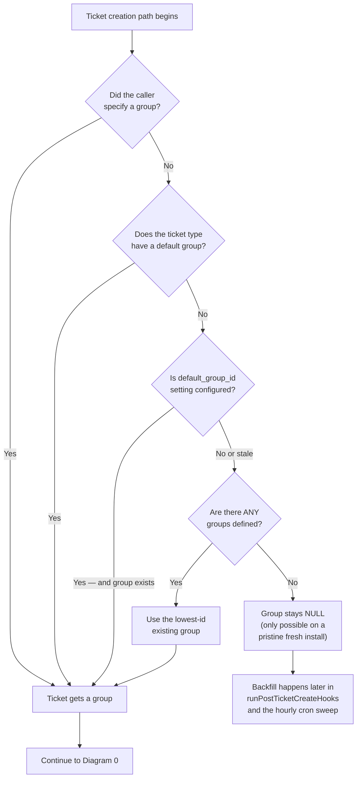

# Ticket Assignment Workflows

Reference diagrams for every auto-assignment rule supported by the helpdesk.

## The cast used in every example

One IT group, four agents. The same data appears in every diagram so you can compare strategies side-by-side.

**Group:** IT — last round-robin pick was Bob.

| Agent | Skills                | Open tickets | Online right now? |
|-------|-----------------------|--------------|-------------------|
| Alice | Printers, Networking  | 3            | Yes — active 30 seconds ago     |
| Bob   | Printers, Servers     | 1            | No — last seen 10 minutes ago   |
| Carol | Servers, Telephony    | 5            | Yes — active 60 seconds ago     |
| Dave  | Networking, Telephony | 2            | No — never seen                 |

**Sample ticket:** Jane Doe submits via the portal:
- **Subject:** "Front desk printer is jamming on every print job"
- **Description:** "When I try to print to the front desk printer it jams every time."
- **Ticket type:** "Printer Issue" — its default group is IT, and it requires the Printers skill.

For the AI Skill-Based diagram, the sample ticket type is the broader "IT Issue" (no required skills) and the AI infers Printers from the content.

---

## Diagram 0 — The master flow

Every newly created ticket goes through these steps before any auto-assignment rule runs. Notice the **three layers of defence** against tickets ending up in the "no group" queue: `resolveTicketGroup()` at INSERT time, `backfillTicketGroupFromDefault()` after AI/automations run, and the hourly cron sweep in `scripts/process-stale-tickets.php`.

**Things to notice:**
- Auto-assignment only happens when a group was matched AND no agent has been assigned yet.
- Automations run *before* auto-assign, so a "set group" automation can redirect the ticket and a "set assignee" automation can short-circuit auto-assign entirely.
- Every rule except Manual can fall back to a backup rule if it can't find anyone — see [Diagram 7](#diagram-7--fallback-flow-when-the-primary-rule-cant-pick-anyone).
- A ticket reaching the "no group queue" outcome is now genuinely rare — only possible on a pristine install that has zero groups defined. See [Diagram 8](#diagram-8--default-group-fallback-the-no-ticket-gets-stuck-safety-net) for the full safety-net flow.

---

## Diagram 1 — Manual (the default)

The system creates the ticket, parks it in the group's queue, and waits for a human to grab it.

**Outcome:** Whichever IT agent picks it up first owns it.
**When to use:** Small teams who self-triage, or when you want a human in the loop on every ticket.

---

## Diagram 2 — Round Robin

Cycles through the group's members in a fixed order. Ignores skill, current load, and online status — it just rotates.

**Outcome:** Carol. Bob is least-loaded and has the right skill, but round-robin doesn't care.
**Edge case:** if the group has never had a round-robin assignment before, the first member of the group is picked.

---

## Diagram 3 — Load-Based

Picks whichever group member has the fewest currently-open tickets.

**Outcome:** Bob. Doesn't check whether he's online or has the right skill — only load matters.
**When to use:** Generalist teams where everyone can handle anything; you mostly care about even queue lengths.

---

## Diagram 4 — Skill-Based (uses the ticket type's required skills)

Filters group members down to those whose skills cover **every** skill the ticket type requires, then picks the least-loaded one of those.

**Outcome:** Bob — has Printers AND fewer open tickets than Alice.
**Edge case:** If you forget to check any required skills on the ticket type, the rule can't pick anyone and the fallback runs. Don't leave it empty unless you mean to.

---

## Diagram 5 — AI Skill-Based

Same shape as Diagram 4, but the "required skills" come from an AI reading the ticket's content instead of checkboxes on the ticket type.

**Outcome:** Bob — same result as plain Skill-Based, but you didn't have to maintain a "Printer Issue" ticket type with required skills checked. One generic "IT Issue" type is enough.

**Edge cases:**
- If the AI provider is unreachable or returns garbage, no skills get tagged and the fallback runs.
- If the AI isn't confident enough (under 70%), the fallback runs. Vague tickets like "computer broken" often miss the threshold.
- If a skill is scoped to a *different* group (e.g. Telephony scoped to Facilities), the AI won't see it for an IT ticket — it can only suggest from global skills and IT-scoped skills.
- Admins can override the AI's suggestion; the override wins.

---

## Diagram 6 — First Available

Filters group members to those currently online, then picks the least-loaded one.

**Outcome:** Alice. Bob would have won on load alone but he's offline. Skills aren't checked at all.
**Why 2 minutes:** browsers slow down background tabs to roughly once-a-minute updates, so a 60-second window would mistakenly mark backgrounded agents as offline.

---

## Diagram 7 — Fallback flow (when the primary rule can't pick anyone)

Every rule except Manual can come up empty (no eligible specialist, no one online, AI not confident enough, etc.). When that happens, the system uses the group's backup rule on the **full group membership** — no filtering.

**Common reasons each rule falls through to the fallback:**

| Rule              | Why it might fall through                                                                    |
|-------------------|----------------------------------------------------------------------------------------------|
| Skill-Based       | Ticket type has no required skills checked, OR no member has all of them                     |
| AI Skill-Based    | AI turned off, type confidential, AI failed, AI not confident enough, no member matched      |
| First Available   | Nobody in the group has been active in the last 2 minutes                                    |
| Round Robin       | Almost never — picks the first member if the previous-pick pointer is missing                |
| Load-Based        | Almost never — only fires if the group has zero members                                      |

**Fallback recommendation:**
- Set the fallback to **Load-Based** if you want every ticket assigned to a human no matter what.
- Set it to **None** if you'd rather have ambiguous tickets sit unassigned for a human to triage.

---

## Diagram 8 — Default-group fallback (the "no ticket gets stuck" safety net)

A separate, **earlier** safety net than Diagram 7. Diagram 7 handles "no eligible *agent* in this group" — Diagram 8 handles "no *group* at all." Configured at **Admin → Settings → Ticket Routing Defaults → Default Group**, this kicks in at three layers:

1. **At creation** — every ticket creation path calls `resolveTicketGroup()`, which chains caller's pick → ticket type's default group → `default_group_id` setting → lowest-id existing group.
2. **After post-create hooks** — `backfillTicketGroupFromDefault()` runs after AI and automations and routes any ticket still sitting with a NULL group to the default.
3. **Hourly cron** — `scripts/process-stale-tickets.php` sweeps any orphans the previous two layers somehow missed (legacy data, hand-edited rows, future creation paths a developer forgot to plumb).

**When to use:** Always. The setting is part of the routing core — leaving it unset is supported but inadvisable, since it's the difference between an inbound email landing in a triaged queue versus sitting invisible in the no-group filter view. Best practice: pick (or create) a generic *Triage* / *Service Desk* group, set it as the system default, and configure that group's auto-assign strategy so the catch-all queue is itself auto-distributed to a human.

**Timeline entry:** When this fallback fires it leaves an internal note on the ticket reading *"No group was matched by ticket type, AI, or automations — routed to the system default group so the ticket does not sit in the no-group queue."* That makes unrouted arrivals visible in normal triage workflow.

---

## Side-by-side comparison

**What each rule considers:**

| Rule              | Filters by skill?         | Balances load?            | Checks who's online?  | Source of "required skills"                                |
|-------------------|---------------------------|---------------------------|-----------------------|------------------------------------------------------------|
| Manual            | —                         | —                         | —                     | —                                                          |
| Round Robin       | No                        | No                        | No                    | —                                                          |
| Load-Based        | No                        | Yes                       | No                    | —                                                          |
| Skill-Based       | Yes                       | Yes (within eligible)     | No                    | Required-skills checkboxes on the ticket type              |
| AI Skill-Based    | Yes                       | Yes (within eligible)     | No                    | AI inference from subject + description; admin can override |
| First Available   | No                        | Yes (within online)       | Yes (last 2 minutes)  | —                                                          |

**The same Jane Doe "Printer Issue" ticket under each rule:**

| Rule              | Picked agent | Why                                                              |
|-------------------|--------------|------------------------------------------------------------------|
| Manual            | (nobody)     | Sits in the queue                                                |
| Round Robin       | Carol        | Next in line after Bob                                           |
| Load-Based        | Bob          | Only 1 open ticket                                               |
| Skill-Based       | Bob          | Has Printers AND lower load than Alice                           |
| AI Skill-Based    | Bob          | AI infers Printers, same eligible set as Skill-Based             |
| First Available   | Alice        | Online, lower load than the other online agent (Carol)           |
